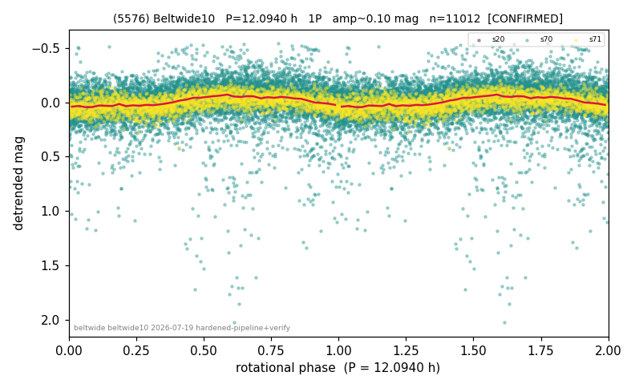

# (5576)

**Adopted:** 24.188 h, 2P, CONFIRMED

<!-- AUTO:START (regenerated from pipeline outputs; do not hand-edit this block) -->
## Evidence (auto)

Detected in 3 sector(s):

| sector | N | baseline (h) | P_phot (h) | power | FAP | cycles | flags |
|--|--|--|--|--|--|--|--|
| s20 | 839 | 630.5 | 12.0396 | 0.6705 | 1.9e-197 | 52.4 | 2P-ambiguous |
| s70 | 7728 | 553.2 | 12.0662 | 0.0791 | 1.9e-133 | 45.8 | star-cleaned:198 |
| s71 | 2445 | 146.3 | 12.1484 | 0.2435 | 1.3e-143 | 12.0 | 2P-ambiguous |

- Pipeline refine said: **1P** (folded amp_fourier 0.141); flags: clean
- DIA (de-comb): not triggered (the object is clean, fast and non-comb, so the test does not apply)
- Coverage: **3 sector(s)**, best sector covers **52.13 cycles** of the adopted period. Measured periodogram peak width 2% of the period, i.e. about **+/- 0.0809 h** (1 sigma); the decimal places in the adopted value are not a precision claim.
- Factor of two: no doubling was applied.
- Gates: FAP<1e-3 and power>=0.10 per detecting sector; >=2 sectors agree (harmonic-aware).
- **Adopted shape 2P OVERRIDES the pipeline's 1P** (doubling audit 2026-07-25: folded amplitude >= 0.25 mag, so a single-peaked curve is physically implausible; Harris convention -> 2P. The census 3-test doubling logic was measured at only 30% recall against 289 LCDB U>=2 ground-truth periods).

### Why this row reads the way it does

- folded_amp=0.087. 3/3 sectors agree within 0.9% (s20/s70/s71, FAP 1e-133..1e-197); comb n=27 cleared by window test; amp<<0.40 -> 1P.
- DOUBLING CORRECTED 2026-08-30: adopted period doubled from 12.094 h. The previous value came from the folded-amplitude rule, which was found biased low (9 of 9 disagreements with MPB 2024-2026 in the same direction). Odd-harmonic test at the long period gives z1=11.96 with margin 9.28 over non-harmonic multiples 1.7x/2.3x (reference group: 0 of 38 above margin 2).

<!-- AUTO:END -->
