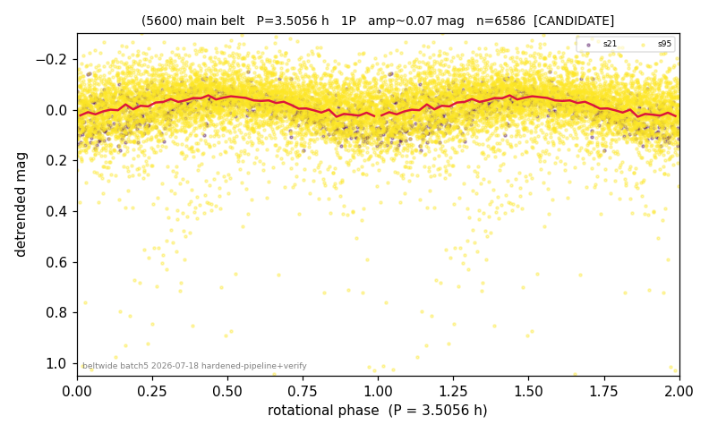

# (5600)

**Adopted:** 3.5056 h, 1P, CANDIDATE

<!-- AUTO:START (regenerated from pipeline outputs; do not hand-edit this block) -->
## Evidence (auto)

Detected in 2 sector(s):

| sector | N | baseline (h) | P_phot (h) | power | FAP | cycles | flags |
|--|--|--|--|--|--|--|--|
| s21 | 870 | 646.5 | 3.5056 | 0.3589 | 7.4e-80 | 92.2 | clean |
| s95 | 5740 | 453.1 | 226.5288 | 0.0793 | 2.3e-98 | 2.0 | star-cleaned:130,grid-edge,phase-curve-r |

- Refined shape: **1P** (folded amp_fourier 0.154); flags: clean
- DIA (de-comb): not triggered (clean, fast, non-comb)
- Gates: FAP<1e-3 and power>=0.10 per detecting sector; single strong sector (candidate ceiling); folded-amplitude rule -> 1P.

<!-- AUTO:END -->
