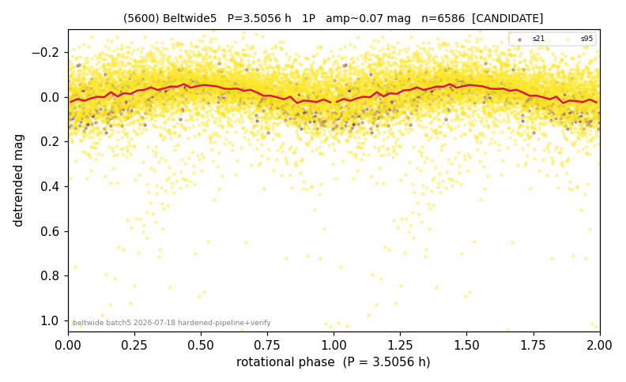

# (5600)

**Adopted:** 3.5056 h, 1P, CANDIDATE

<!-- AUTO:START (regenerated from pipeline outputs; do not hand-edit this block) -->
## Evidence (auto)

Detected in 2 sector(s):

| sector | N | baseline (h) | P_phot (h) | power | FAP | cycles | flags |
|--|--|--|--|--|--|--|--|
| s21 | 870 | 646.5 | 3.5056 | 0.3589 | 7.4e-80 | 92.2 | clean |
| s95 | 5740 | 453.1 | 226.5288 | 0.0793 | 2.3e-98 | 2.0 | star-cleaned:130,grid-edge,phase-curve-r |

- Pipeline refine said: **1P** (folded amp_fourier 0.154); flags: clean
- DIA (de-comb): not triggered (the object is clean, fast and non-comb, so the test does not apply)
- Coverage: **2 sector(s)**, best sector covers **184.42 cycles** of the adopted period. Measured periodogram peak width 0% of the period, i.e. about **+/- 0.007035 h** (1 sigma); the decimal places in the adopted value are not a precision claim.
- Factor of two: no doubling was applied.
- Gates: FAP<1e-3 and power>=0.10 per detecting sector; single strong sector (candidate ceiling).
- Adopted shape: **1P** (folded-amplitude rule; pipeline agrees).

### Why this row reads the way it does

- s21 LS P=3.506h pw=0.359 FAP=7.4e-80 (184 cycles) strong solo detect. s95 global best is grid-edge slow trend (non-signal); at fixed P0, s95 pw=0.043<

<!-- AUTO:END -->
