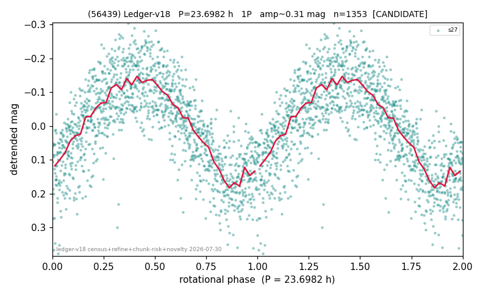

# (56439)

**Adopted:** 23.6982 h, 1P, CANDIDATE

<!-- AUTO:START (regenerated from pipeline outputs; do not hand-edit this block) -->
## Evidence (auto)

Detected in 1 sector(s):

| sector | N | baseline (h) | P_phot (h) | power | FAP | cycles | flags |
|--|--|--|--|--|--|--|--|
| s27 | 1354 | 268.5 | 23.6982 | 0.6363 | 2.4e-292 | 11.3 | 2P-ambiguous |

- Pipeline refine said: **1P** (folded amp_fourier 0.323); flags: near-comb(amp-cleared):n=14
- DIA (de-comb): survived(dPW=+1%,R2=0.07,s27@23.698h,1sec)
- Gates: FAP<1e-3 and power>=0.10 per detecting sector; single strong sector (candidate ceiling).
- Adopted shape: **1P** (folded-amplitude rule; pipeline agrees).

### Why this row reads the way it does

- 1 sector(s) detecting
- single-peaked at folded amp 0.323 mag

<!-- AUTO:END -->
