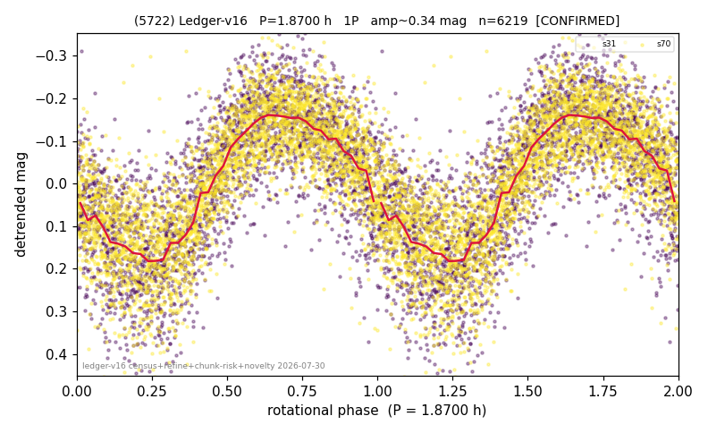

# (5722)

**Adopted:** 1.87 h, 1P, CONFIRMED

<!-- AUTO:START (regenerated from pipeline outputs; do not hand-edit this block) -->
## Evidence (auto)

Detected in 2 sector(s):

| sector | N | baseline (h) | P_phot (h) | power | FAP | cycles | flags |
|--|--|--|--|--|--|--|--|
| s31 | 2691 | 610.2 | 1.8694 | 0.514 | 0.0e+00 | 326.4 | 2P-ambiguous |
| s70 | 3545 | 244.4 | 1.8702 | 0.6416 | 0.0e+00 | 65.4 | clean |

- Pipeline refine said: **1P** (folded amp_fourier 0.391); flags: sick-dips-excised:s70(5);near-threshold:0.39
- DIA (de-comb): not triggered (clean, fast, non-comb)
- Gates: FAP<1e-3 and power>=0.10 per detecting sector; >=2 sectors agree (harmonic-aware).
- Adopted shape: **1P** (folded-amplitude rule; pipeline agrees).

### Why this row reads the way it does

- 2 sector(s) detecting
- cross-sector fold correlation 0.99
- single-peaked at folded amp 0.391 mag

<!-- AUTO:END -->
