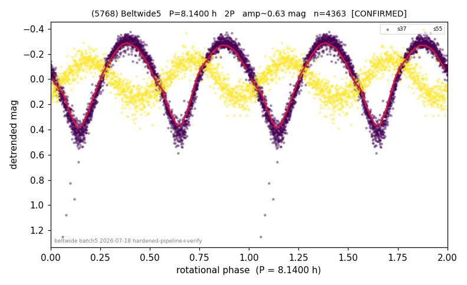

# (5768)

**Adopted:** 8.14 h, 2P, CONFIRMED

<!-- AUTO:START (regenerated from pipeline outputs; do not hand-edit this block) -->
## Evidence (auto)

Detected in 3 sector(s):

| sector | N | baseline (h) | P_phot (h) | power | FAP | cycles | flags |
|--|--|--|--|--|--|--|--|
| s37 | 2904 | 602.5 | 4.0704 | 0.9377 | 0.0e+00 | 148.0 | 2P-ambiguous |
| s55 | 1459 | 290.2 | 4.0701 | 0.7794 | 0.0e+00 | 71.3 | 2P-ambiguous |
| s91 | 2309 | 165.7 | 4.0709 | 0.7885 | 0.0e+00 | 40.7 | star-cleaned:25,2P-ambiguous |

- Pipeline refine said: **2P** (folded amp_fourier 0.706); flags: sick-dips-excised:s37(1)
- DIA (de-comb): survived_v2(ret=1.000[1.00-1.00],s37@4.070h)
- Coverage: **3 sector(s)**, best sector covers **74.02 cycles** of the adopted period. Measured periodogram peak width 1% of the period, i.e. about **+/- 0.01089 h** (1 sigma); the decimal places in the adopted value are not a precision claim.
- Factor of two: **adopted on the amplitude convention**: standard practice for an elongated body, but a convention rather than a measurement.
- Gates: FAP<1e-3 and power>=0.10 per detecting sector; >=2 sectors agree (harmonic-aware).
- Adopted shape: **2P** (folded-amplitude rule; pipeline agrees).

### Why this row reads the way it does

- LS s37 P=4.070h(pw=0.94,FAP=0),s55 P=4.070h(pw=0.78,FAP=0),agree to 0.01%. Folded amp s37=0.72,s55=0.31,combined=0.67, all>0.40 -> elongated, adopt 2P
- s91 crowding-rescued (2026-08-08, |b| 5-15 deg rescue, 5-point crowding penalty, 72 vs 77 per cent LCDB agreement): power 0.71, FAP 0.0e+00 at the adopted photometric period, 20.4 cycles, direct
- 2P by amplitude rule (folded_amp=0.706)

<!-- AUTO:END -->
