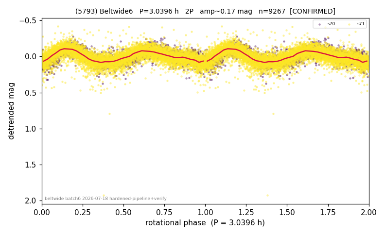

# (5793)

**Adopted:** 3.0396 h, 2P, CONFIRMED

<!-- AUTO:START (regenerated from pipeline outputs; do not hand-edit this block) -->
## Evidence (auto)

Detected in 2 sector(s):

| sector | N | baseline (h) | P_phot (h) | power | FAP | cycles | flags |
|--|--|--|--|--|--|--|--|
| s70 | 1282 | 71.2 | 1.5199 | 0.3441 | 4.2e-113 | 46.8 | 2P-ambiguous |
| s71 | 7985 | 597.0 | 1.5198 | 0.3566 | 0.0e+00 | 392.8 | star-cleaned:24,2P-ambiguous |

- Refined shape: **1P** (folded amp_fourier 0.179); flags: sick-dips-excised:s71(1)
- DIA (de-comb): survived(dPW=+2%,R2=0.03,s70@1.520h,4sec)
- Gates: FAP<1e-3 and power>=0.10 per detecting sector; >=2 sectors agree (harmonic-aware); folded-amplitude rule -> 2P.

<!-- AUTO:END -->

## Doubt
Photometric period is 1.52 h (power 0.34-0.36, FAP 1e-113/~0, over 47 and 393 cycles in s70/s71). 1.52 h looks alarming.
## Evidence
SBDB: D = 8.068 km (H=12.62, albedo 0.306). An 8 km rubble pile has a cohesionless spin barrier at ~2.3 h; 1.52 h is far below it and is physically impossible for a body this size (centrifugal > self-gravity -> disruption). So 1.52 h is the 2nd harmonic and P_rot = 2 x 1.52 = 3.0396 h. Folded amp 0.19 (mild elongation, near-symmetric minima) is consistent with a low-elongation 2P body seen near-equator.
## Verdict
2P / 3.0396 h, high confidence. The doubling is forced by PHYSICS, not amplitude. **Not a 1.52 h fast rotator; do not revert to the photometric value.**
