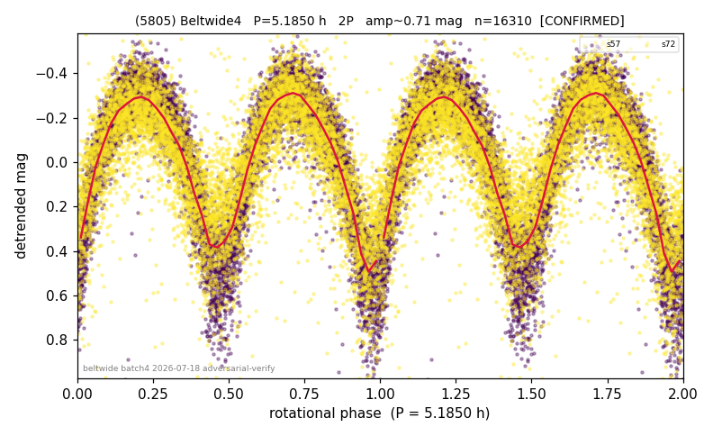

# (5805)

**Adopted:** 5.185 h, 2P, CONFIRMED

<!-- AUTO:START (regenerated from pipeline outputs; do not hand-edit this block) -->
## Evidence (auto)

Detected in 2 sector(s):

| sector | N | baseline (h) | P_phot (h) | power | FAP | cycles | flags |
|--|--|--|--|--|--|--|--|
| s57 | 8702 | 672.9 | 2.5914 | 0.7329 | 0.0e+00 | 259.7 | 2P-ambiguous |
| s72 | 7631 | 541.3 | 2.5924 | 0.5984 | 0.0e+00 | 208.8 | star-cleaned:55,2P-ambiguous |

- Pipeline refine said: **2P** (folded amp_fourier 0.789); flags: sick-dips-excised:s57(2),s72(21)
- DIA (de-comb): survived(dPW=+0%,R2=0.00,s57@2.592h,4sec)
- Gates: FAP<1e-3 and power>=0.10 per detecting sector; >=2 sectors agree (harmonic-aware).
- Adopted shape: **2P** (folded-amplitude rule; pipeline agrees).

### Why this row reads the way it does

- Both sectors independently and precisely agree on the base photometric period (S57 P=2.5919h power=0.759 FAP~0; S72 P=2.5928h power=0.591 FAP~0; 0.03%

<!-- AUTO:END -->
