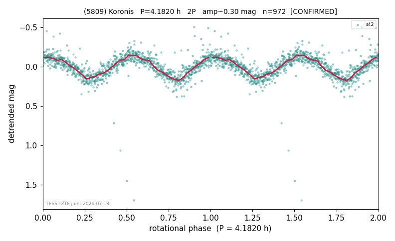

# (5809)

**Adopted:** 4.182 h, 2P, CONFIRMED

<!-- AUTO:START (regenerated from pipeline outputs; do not hand-edit this block) -->
## Evidence (auto)

Detected in 1 sector(s):

| sector | N | baseline (h) | P_phot (h) | power | FAP | cycles | flags |
|--|--|--|--|--|--|--|--|
| s42 | 972 | 163.7 | 2.0911 | 0.6715 | 3.9e-230 | 78.3 | star-cleaned:6,2P-ambiguous |

- Refined shape: **1P** (folded amp_fourier 0.284); flags: sick-dips-excised:s42(3)
- DIA (de-comb): survived(dPW=+1%,R2=0.04,s42@2.091h,1sec)
- Gates: FAP<1e-3 and power>=0.10 per detecting sector; >=2 sectors agree (harmonic-aware); folded-amplitude rule -> 2P.

<!-- AUTO:END -->
