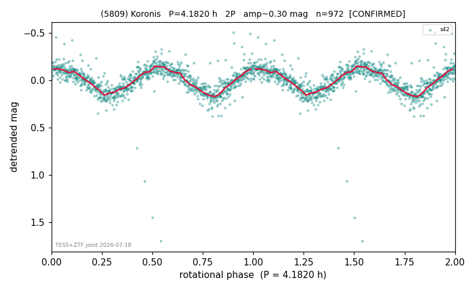

# (5809)

**Adopted:** 4.182 h, 2P, CONFIRMED

<!-- AUTO:START (regenerated from pipeline outputs; do not hand-edit this block) -->
## Evidence (auto)

Detected in 2 sector(s):

| sector | N | baseline (h) | P_phot (h) | power | FAP | cycles | flags |
|--|--|--|--|--|--|--|--|
| s42 | 972 | 163.7 | 2.0911 | 0.6715 | 3.9e-230 | 78.3 | star-cleaned:6,2P-ambiguous |
| s92 | 7069 | 512.6 | 2.0925 | 0.0752 | 3.2e-115 | 245.0 | star-cleaned:67 |

- Pipeline refine said: **1P** (folded amp_fourier 0.284); flags: sick-dips-excised:s42(3)
- DIA (de-comb): survived_v2(ret=1.000[1.00-1.00],s42@2.091h)
- Coverage: **2 sector(s)**, best sector covers **122.58 cycles** of the adopted period. Measured periodogram peak width 0% of the period, i.e. about **+/- 0.00373 h** (1 sigma); the decimal places in the adopted value are not a precision claim.
- Factor of two: **measured on the data** (odd-harmonic power or unequal minima, significant and reproduced), METHODOLOGY 3b.
- Gates: FAP<1e-3 and power>=0.10 per detecting sector; >=2 sectors agree (harmonic-aware).
- **Adopted shape 2P OVERRIDES the pipeline's 1P** (doubling audit 2026-07-25: folded amplitude >= 0.25 mag, so a single-peaked curve is physically implausible; Harris convention -> 2P. The census 3-test doubling logic was measured at only 30% recall against 289 LCDB U>=2 ground-truth periods).

### Why this row reads the way it does

- TESS single-sector + ZTF independent blind-recovery (FAP<<1e-8) = 2nd realization. TESS sector 42 alone gives a dominant, clean LS peak at P_base=2.0920h (power=0.671, ~25x
- 2P physics-forced (sub-barrier): 2P by spin-barrier physics (base 2.092h sub/near-barrier); ZTF blind-recovery of base period corroborates (FAP 1.1e-50), 20% minima asymmetry also noted

<!-- AUTO:END -->
