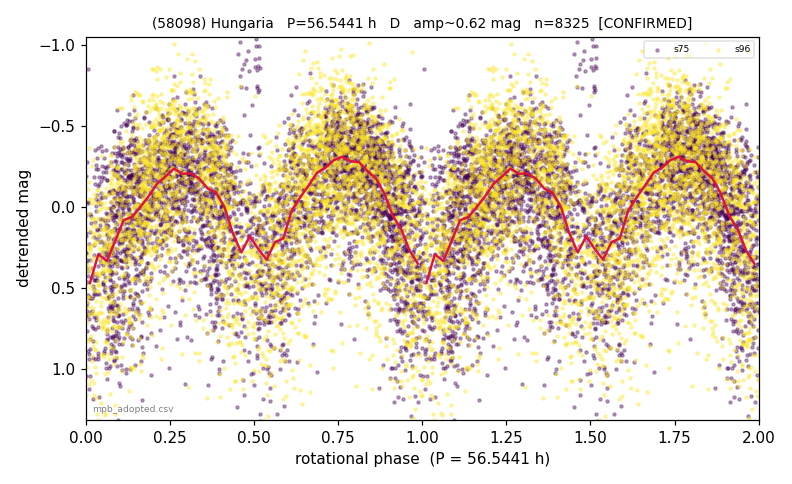

# (58098)

**Adopted:** 56.5441 h, D, CONFIRMED

<!-- AUTO:START (regenerated from pipeline outputs; do not hand-edit this block) -->
## Evidence (auto)

Detected in 0 sector(s):

| sector | N | baseline (h) | P_phot (h) | power | FAP | cycles | flags |
|--|--|--|--|--|--|--|--|

- Coverage: **2 sector(s)**, best sector covers **6.82 cycles** of the adopted period. Measured periodogram peak width 13% of the period, i.e. about **+/- 3.026 h** (1 sigma); the decimal places in the adopted value are not a precision claim.
- Factor of two: no doubling was applied.
- Gates: FAP<1e-3 and power>=0.10 per detecting sector; >=2 sectors agree (harmonic-aware).
- Adopted shape: **D** (folded-amplitude rule; pipeline agrees).

### Why this row reads the way it does

- paper #1 (MPB 53-415, revised, 19 objects)

<!-- AUTO:END -->
