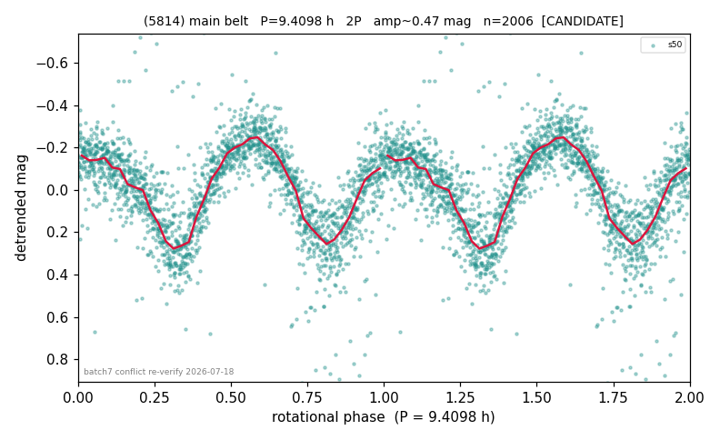

# (5814)

**Adopted:** 9.4098 h, 2P, CANDIDATE

<!-- AUTO:START (regenerated from pipeline outputs; do not hand-edit this block) -->
## Evidence (auto)

Detected in 1 sector(s):

| sector | N | baseline (h) | P_phot (h) | power | FAP | cycles | flags |
|--|--|--|--|--|--|--|--|
| s50 | 2026 | 626.8 | 4.7049 | 0.5649 | 0.0e+00 | 133.2 | star-cleaned:25,2P-ambiguous |

- Gates: FAP<1e-3 and power>=0.10 per detecting sector; single strong sector (candidate ceiling); folded-amplitude rule -> 2P.

<!-- AUTO:END -->

## Reasoning
Single sector s50, folded amp 0.551 > 0.40 with a real half-cycle asymmetry -> 2P (not the 'identical minima' trap).
## Verdict
CANDIDATE 2P / 9.4098 h (single-sector cap).
