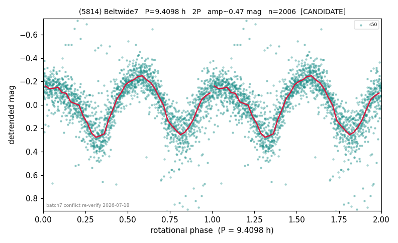

# (5814)

**Adopted:** 9.4098 h, 2P, CANDIDATE

<!-- AUTO:START (regenerated from pipeline outputs; do not hand-edit this block) -->
## Evidence (auto)

Detected in 1 sector(s):

| sector | N | baseline (h) | P_phot (h) | power | FAP | cycles | flags |
|--|--|--|--|--|--|--|--|
| s50 | 2026 | 626.8 | 4.7049 | 0.5649 | 0.0e+00 | 133.2 | star-cleaned:25,2P-ambiguous |

- Pipeline refine said: **2P** (folded amp_fourier 0.505); flags: sick-dips-excised:s50(19)
- DIA (de-comb): survived(dPW=+1%,R2=0.13,s50@4.705h,2sec)
- Gates: FAP<1e-3 and power>=0.10 per detecting sector; single strong sector (candidate ceiling).
- Adopted shape: **2P** (folded-amplitude rule; pipeline agrees).

### Why this row reads the way it does

- batch7 conflict re-verify 2026-07-18: single-sector s50; folded amp 0.551>0.40 -> 2P/9.41h (full half-cycle test shows real asymmetry, not identical-minima); CANDIDATE (single-sector cap)

<!-- AUTO:END -->

## Reasoning
Single sector s50, folded amp 0.551 > 0.40 with a real half-cycle asymmetry -> 2P (not the 'identical minima' trap).
## Verdict
CANDIDATE 2P / 9.4098 h (single-sector cap).
