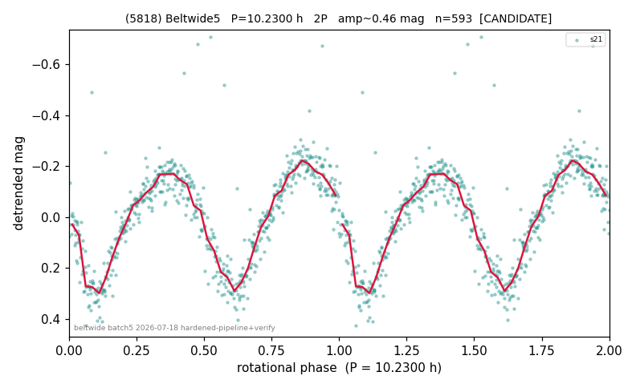

# (5818)

**Adopted:** 10.23 h, 2P, CANDIDATE

<!-- AUTO:START (regenerated from pipeline outputs; do not hand-edit this block) -->
## Evidence (auto)

Detected in 1 sector(s):

| sector | N | baseline (h) | P_phot (h) | power | FAP | cycles | flags |
|--|--|--|--|--|--|--|--|
| s21 | 593 | 467.0 | 5.1153 | 0.5325 | 1.1e-93 | 91.3 | star-cleaned:1,2P-ambiguous |

- Pipeline refine said: **2P** (folded amp_fourier 0.469); flags: clean
- DIA (de-comb): not triggered (the object is clean, fast and non-comb, so the test does not apply)
- Coverage: **1 sector(s)**, best sector covers **45.65 cycles** of the adopted period. Measured periodogram peak width 1% of the period, i.e. about **+/- 0.02053 h** (1 sigma); the decimal places in the adopted value are not a precision claim.
- Factor of two: **adopted on the amplitude convention**: standard practice for an elongated body, but a convention rather than a measurement.
- Gates: FAP<1e-3 and power>=0.10 per detecting sector; single strong sector (candidate ceiling).
- Adopted shape: **2P** (folded-amplitude rule; pipeline agrees).

### Why this row reads the way it does

- LS P=5.116h(pow=0.53,FAP=3e-93) matches queue. Folded_amp=0.50mag>0.40->elongated, adopt 2P=10.23h (queue=10.2306h). two_minima_dmag asymmetric@1x(0.3

<!-- AUTO:END -->
