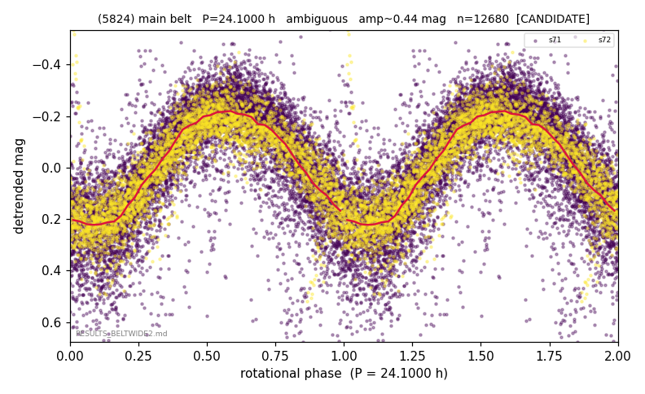

# (5824)

**Adopted:** 24.1 h, ambiguous, CANDIDATE

<!-- AUTO:START (regenerated from pipeline outputs; do not hand-edit this block) -->
## Evidence (auto)

Detected in 2 sector(s):

| sector | N | baseline (h) | P_phot (h) | power | FAP | cycles | flags |
|--|--|--|--|--|--|--|--|
| s71 | 9119 | 581.9 | 24.1272 | 0.5923 | 0.0e+00 | 12.1 | star-cleaned:82 |
| s72 | 3644 | 258.2 | 24.0694 | 0.796 | 0.0e+00 | 10.7 | star-cleaned:67,2P-ambiguous |

- Pipeline refine said: **2P** (folded amp_fourier 0.522); flags: near-comb(amp-cleared):n=7,14;sick-dips-excised:s71(35)
- DIA (de-comb): survived(dPW=+7%,R2=0.13,s72@24.098h,4sec)
- Coverage: **3 sector(s)**, best sector covers **27.03 cycles** of the adopted period. Measured periodogram peak width 4% of the period, i.e. about **+/- 0.3601 h** (1 sigma); the decimal places in the adopted value are not a precision claim.
- Factor of two: no doubling was applied.
- Gates: FAP<1e-3 and power>=0.10 per detecting sector; single strong sector (candidate ceiling).
- **Adopted shape ambiguous OVERRIDES the pipeline's 2P** (doubling audit 2026-07-25: folded amplitude >= 0.25 mag, so a single-peaked curve is physically implausible; Harris convention -> ambiguous. The census 3-test doubling logic was measured at only 30% recall against 289 LCDB U>=2 ground-truth periods).

### Why this row reads the way it does

- VIRGIN; base 24.1h real, 1P/2P doubling unresolved
- s39 crowding-rescued (2026-08-08, |b| 5-15 deg rescue, 5-point crowding penalty, 72 vs 77 per cent LCDB agreement): power 0.63, FAP 0.0e+00 at the adopted photometric period, 27.0 cycles, chunk-extracted

<!-- AUTO:END -->
