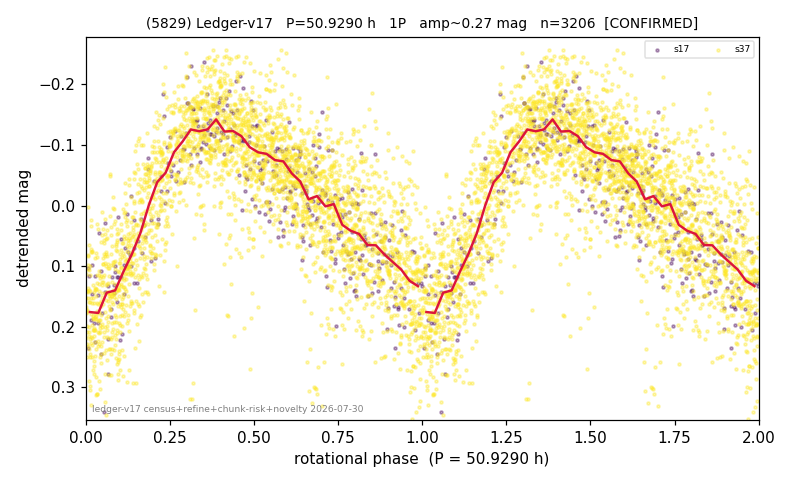

# (5829)

**Adopted:** 50.929 h, 1P, CONFIRMED

<!-- AUTO:START (regenerated from pipeline outputs; do not hand-edit this block) -->
## Evidence (auto)

Detected in 2 sector(s):

| sector | N | baseline (h) | P_phot (h) | power | FAP | cycles | flags |
|--|--|--|--|--|--|--|--|
| s17 | 370 | 224.0 | 50.6558 | 0.6576 | 7.1e-82 | 4.4 | 2P-ambiguous |
| s37 | 2853 | 602.5 | 51.2021 | 0.5837 | 0.0e+00 | 11.8 | star-cleaned:1,2P-ambiguous |

- Pipeline refine said: **1P** (folded amp_fourier 0.276); flags: sick-dips-excised:s37(1)
- DIA (de-comb): **NOT RUN for this lot.** No de-comb verdict exists for this object, so momentum-dump contamination has not been excluded by that test here.
- Gates: FAP<1e-3 and power>=0.10 per detecting sector; >=2 sectors agree (harmonic-aware).
- Adopted shape: **1P** (folded-amplitude rule; pipeline agrees).

### Why this row reads the way it does

- 2 sector(s) detecting
- cross-sector fold correlation 0.96
- single-peaked at folded amp 0.276 mag

<!-- AUTO:END -->
