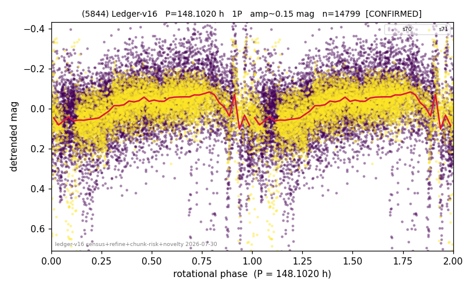

# (5844)

**Adopted:** 148.102 h, 1P, CONFIRMED

<!-- AUTO:START (regenerated from pipeline outputs; do not hand-edit this block) -->
## Evidence (auto)

Detected in 2 sector(s):

| sector | N | baseline (h) | P_phot (h) | power | FAP | cycles | flags |
|--|--|--|--|--|--|--|--|
| s70 | 8760 | 593.1 | 149.6647 | 0.1147 | 1.2e-226 | 4.0 | star-cleaned:297,2P-untestable,2P-ambigu |
| s71 | 6204 | 430.6 | 146.5387 | 0.2545 | 0.0e+00 | 2.9 | star-cleaned:143,2P-untestable,2P-ambigu |

- Pipeline refine said: **1P** (folded amp_fourier 0.188); flags: few-cycle:2.0;sick-dips-excised:s70(38),s71(60);harmonic-only-agreement:s70(pw=0.10)
- DIA (de-comb): inconclusive(dPW=+62%,R2=0.17,s71@148.102h)
- Gates: FAP<1e-3 and power>=0.10 per detecting sector; >=2 sectors agree (harmonic-aware).
- Adopted shape: **1P** (folded-amplitude rule; pipeline agrees).

### Why this row reads the way it does

- 2 sector(s) detecting
- cross-sector fold correlation 0.64
- single-peaked at folded amp 0.188 mag
- pipeline flag: few-cycle
- pipeline flag: harmonic-only-agreement

<!-- AUTO:END -->
