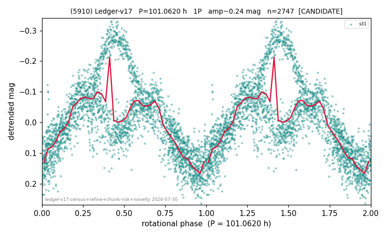

# (5910)

**Adopted:** 202.124 h, 2P, CANDIDATE

<!-- AUTO:START (regenerated from pipeline outputs; do not hand-edit this block) -->
## Evidence (auto)

Detected in 1 sector(s):

| sector | N | baseline (h) | P_phot (h) | power | FAP | cycles | flags |
|--|--|--|--|--|--|--|--|
| s31 | 2749 | 610.2 | 101.062 | 0.544 | 0.0e+00 | 6.0 | 2P-ambiguous |

- Pipeline refine said: **1P** (folded amp_fourier 0.306); flags: few-cycle:3.0;gap-alias-risk:57h
- DIA (de-comb): survived(dPW=+12%,R2=0.44,s31@101.062h,2sec)
- Coverage: **1 sector(s)**, best sector covers **3.02 cycles** of the adopted period. Measured periodogram peak width 14% of the period, i.e. about **+/- 6.15 h** (1 sigma); the decimal places in the adopted value are not a precision claim.
- Factor of two: **measured on the data** (odd-harmonic power or unequal minima, significant and reproduced), METHODOLOGY 3b.
- Gates: FAP<1e-3 and power>=0.10 per detecting sector; single strong sector (candidate ceiling).
- **Adopted shape 2P OVERRIDES the pipeline's 1P** (doubling audit 2026-07-25: folded amplitude >= 0.25 mag, so a single-peaked curve is physically implausible; Harris convention -> 2P. The census 3-test doubling logic was measured at only 30% recall against 289 LCDB U>=2 ground-truth periods).

### Why this row reads the way it does

- 1 sector(s) detecting
- single-peaked at folded amp 0.306 mag
- pipeline flag: few-cycle
- CORRECTED 101.062->202.1240 h (2026-08-02 full 1P re-audit): doubling MEASURED at odd-harmonic 26.5 sigma with ALL detecting sectors significant (1/1); threshold odd>=8+full-reproduction calibrated to 0/60 false fires on the 4P null test (the minima-asymmetry branch alone fired falsely at z up to 34 and is not accepted)

<!-- AUTO:END -->
