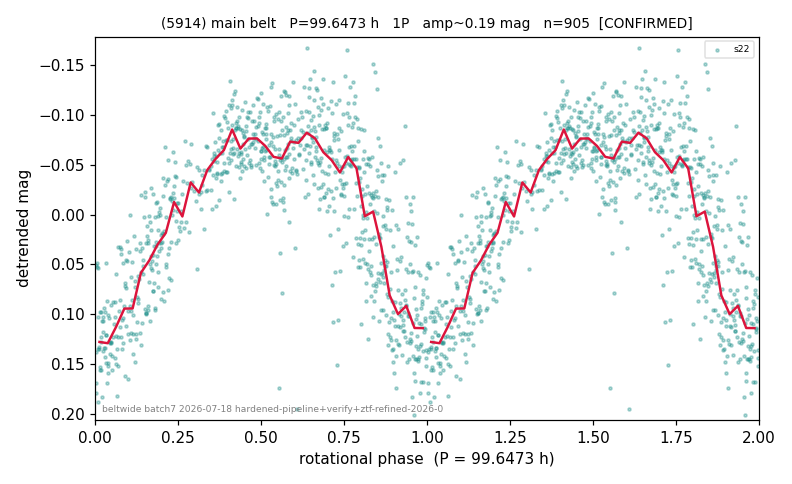

# (5914)

**Adopted:** 99.0 h, 1P, CANDIDATE

<!-- AUTO:START (regenerated from pipeline outputs; do not hand-edit this block) -->
## Evidence (auto)

Detected in 1 sector(s):

| sector | N | baseline (h) | P_phot (h) | power | FAP | cycles | flags |
|--|--|--|--|--|--|--|--|
| s22 | 906 | 640.5 | 99.0 | 0.6277 | 1.4e-189 | 6.5 | 2P-ambiguous |

- Pipeline refine said: **1P** (folded amp_fourier 0.231); flags: few-cycle:3.2;gap-alias-risk:107h
- DIA (de-comb): survived(dPW=+2%,R2=0.13,s22@99.000h,2sec)
- Gates: FAP<1e-3 and power>=0.10 per detecting sector; single strong sector (candidate ceiling).
- Adopted shape: **1P** (folded-amplitude rule; pipeline agrees).

### Why this row reads the way it does

- Reproduced queue: LS P=99.0h pw=0.628 FAP=1.4e-189 (s22, single sector). Decomb SURVIVED: dPW=+1.9%,R2=0.125 (matches queue +2%/0.13); comb

<!-- AUTO:END -->
