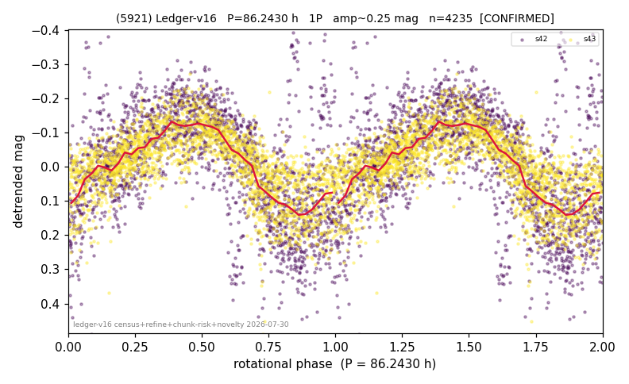

# (5921)

**Adopted:** 86.243 h, 1P, CONFIRMED

<!-- AUTO:START (regenerated from pipeline outputs; do not hand-edit this block) -->
## Evidence (auto)

Detected in 2 sector(s):

| sector | N | baseline (h) | P_phot (h) | power | FAP | cycles | flags |
|--|--|--|--|--|--|--|--|
| s42 | 2093 | 550.7 | 86.4396 | 0.4177 | 5.5e-241 | 6.4 | star-cleaned:6,2P-ambiguous |
| s43 | 2195 | 527.3 | 86.0456 | 0.5202 | 0.0e+00 | 3.1 | star-cleaned:8 |

- Pipeline refine said: **1P** (folded amp_fourier 0.327); flags: few-cycle:3.2;sick-dips-excised:s42(14),s43(4)
- DIA (de-comb): not triggered (clean, fast, non-comb)
- Gates: FAP<1e-3 and power>=0.10 per detecting sector; >=2 sectors agree (harmonic-aware).
- Adopted shape: **1P** (folded-amplitude rule; pipeline agrees).

### Why this row reads the way it does

- 2 sector(s) detecting
- cross-sector fold correlation 0.90
- single-peaked at folded amp 0.327 mag
- pipeline flag: few-cycle

<!-- AUTO:END -->
