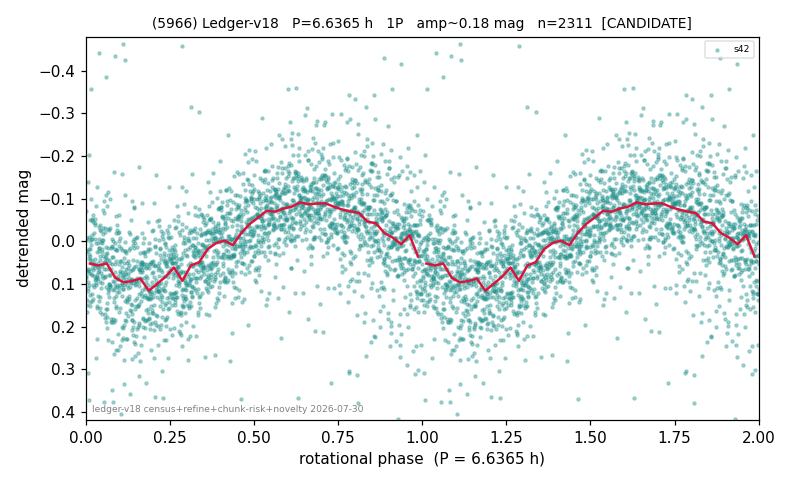

# (5966)

**Adopted:** 6.6365 h, 1P, CANDIDATE

<!-- AUTO:START (regenerated from pipeline outputs; do not hand-edit this block) -->
## Evidence (auto)

Detected in 1 sector(s):

| sector | N | baseline (h) | P_phot (h) | power | FAP | cycles | flags |
|--|--|--|--|--|--|--|--|
| s42 | 2320 | 590.0 | 6.6365 | 0.31 | 2.7e-182 | 44.5 | star-cleaned:22 |

- Pipeline refine said: **1P** (folded amp_fourier 0.247); flags: sick-dips-excised:s42(5)
- DIA (de-comb): survived_v2(ret=0.996[0.99-1.00],s42@6.636h)
- Coverage: **1 sector(s)**, best sector covers **88.91 cycles** of the adopted period. Measured periodogram peak width 1% of the period, i.e. about **+/- 0.02516 h** (1 sigma); the decimal places in the adopted value are not a precision claim.
- Factor of two: no doubling was applied.
- Gates: FAP<1e-3 and power>=0.10 per detecting sector; single strong sector (candidate ceiling).
- Adopted shape: **1P** (folded-amplitude rule; pipeline agrees).

### Why this row reads the way it does

- 1 sector(s) detecting
- single-peaked at folded amp 0.247 mag

<!-- AUTO:END -->
