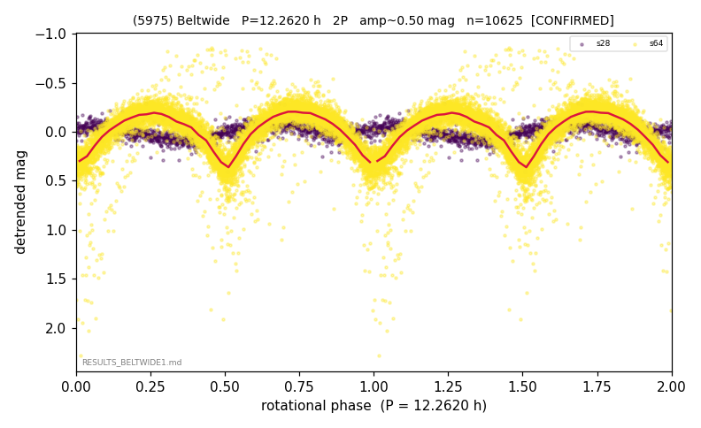

# (5975)

**Adopted:** 12.262 h, 2P, CONFIRMED

<!-- AUTO:START (regenerated from pipeline outputs; do not hand-edit this block) -->
## Evidence (auto)

Detected in 2 sector(s):

| sector | N | baseline (h) | P_phot (h) | power | FAP | cycles | flags |
|--|--|--|--|--|--|--|--|
| s28 | 1443 | 325.8 | 6.13 | 0.3875 | 4.6e-149 | 53.2 | star-cleaned:7 |
| s64 | 9182 | 628.6 | 6.1317 | 0.7144 | 0.0e+00 | 102.5 | star-cleaned:62,2P-ambiguous |

- Refined shape: **1P** (folded amp_fourier 0.164); flags: sector-dropped:s64(range>3mag)
- DIA (de-comb): survived(dPW=+0%,R2=0.00,s64@6.131h,4sec)
- Gates: FAP<1e-3 and power>=0.10 per detecting sector; >=2 sectors agree (harmonic-aware); folded-amplitude rule -> 2P.

<!-- AUTO:END -->
