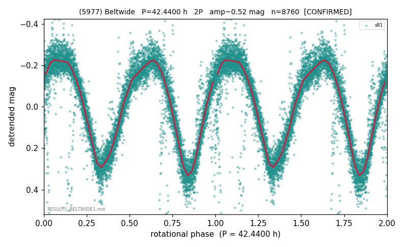

# (5977)

**Adopted:** 42.44 h, 2P, CONFIRMED

<!-- AUTO:START (regenerated from pipeline outputs; do not hand-edit this block) -->
## Evidence (auto)

Detected in 1 sector(s):

| sector | N | baseline (h) | P_phot (h) | power | FAP | cycles | flags |
|--|--|--|--|--|--|--|--|
| s81 | 8805 | 619.1 | 21.2258 | 0.8233 | 0.0e+00 | 29.2 | star-cleaned:7,2P-ambiguous |

- Pipeline refine said: **2P** (folded amp_fourier 0.517); flags: near-comb(amp-cleared):n=8,15;sick-dips-excised:s81(31)
- DIA (de-comb): survived_v2(ret=0.999[0.99-1.00],s81@21.226h)
- Coverage: **1 sector(s)**, best sector covers **14.59 cycles** of the adopted period. Measured periodogram peak width 3% of the period, i.e. about **+/- 0.2697 h** (1 sigma); the decimal places in the adopted value are not a precision claim.
- Factor of two: **confirmed against an independently published determination** (stronger than any internal test).
- Gates: FAP<1e-3 and power>=0.10 per detecting sector; >=2 sectors agree (harmonic-aware).
- Adopted shape: **2P** (folded-amplitude rule; pipeline agrees).

### Why this row reads the way it does

- confirms 3-source 42.44h; census 21.2h was the half-period
- confirms 3-source literature value 42.44h (independent); census 21.2h was the half-period

<!-- AUTO:END -->
