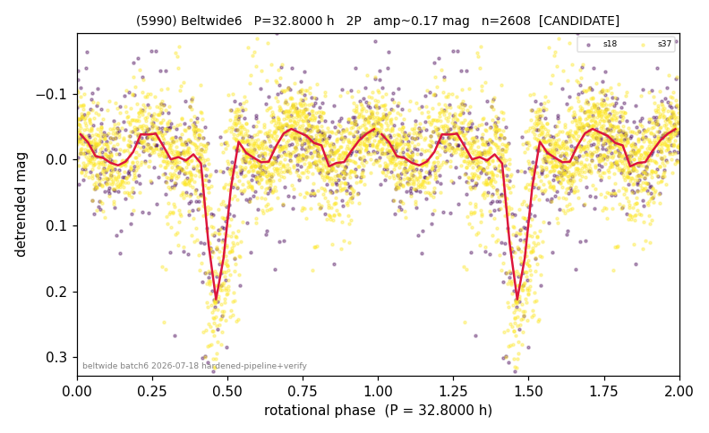

# (5990)

**Adopted:** 32.8 h, 2P, CANDIDATE

<!-- AUTO:START (regenerated from pipeline outputs; do not hand-edit this block) -->
## Evidence (auto)

Detected in 2 sector(s):

| sector | N | baseline (h) | P_phot (h) | power | FAP | cycles | flags |
|--|--|--|--|--|--|--|--|
| s18 | 582 | 469.5 | 8.2992 | 0.1254 | 1.4e-13 | 56.6 | 2P-ambiguous |
| s37 | 2038 | 435.2 | 16.4011 | 0.1109 | 6.8e-48 | 13.3 | clean |

- Refined shape: **1P** (folded amp_fourier 0.092); flags: harmonic-only-agreement:s18(pw=0.07),s37(pw=0.02);period-spread:66%
- DIA (de-comb): not triggered (clean, fast, non-comb)
- Gates: FAP<1e-3 and power>=0.10 per detecting sector; single strong sector (candidate ceiling); folded-amplitude rule -> 2P.

<!-- AUTO:END -->

## Reasoning (hand-written)

**Why CANDIDATE, not CONFIRMED.** The two sectors do not independently agree: s18's
photometric best period (8.30 h) and s37's (16.40 h) relate only harmonically, and the
fundamental power is weak in both (0.07 / 0.02). The census initially reported 8.25 h /
1P; adversarial verification downgraded to CANDIDATE at 32.80 h / 2P (folded-amplitude
convention applied to the s37 fundamental). Needs a third epoch or an independent data
source (e.g. ZTF) to settle the harmonic ambiguity.

**The "strange dip" (reviewed 2026-07-19).** The fold showed isolated faint excursions
of 0.5 to 0.8 mag. Forensics: in s37 they form three brief events (durations 0.3 to
1.2 h) ALL within the first 40 h of a ~435 h track, the deepest at the very first
cadences; in s18 a single 0.5 h pair near the end of the track. At P = 32.8 h the s37
track covers ~13 cycles, and none of these features recurs at the same phase in any
other cycle, which rules out a rotational minimum or an eclipse (either would repeat
every cycle). The neighbouring track (3858) in s37 shows the identical first-hour
faint ramp, identifying the class as track-start scattered-light systematics plus
field-star crossings. Their photometric errors are normal (1.6 to 1.8x the sector
median), so the error-gated sick-dip rule correctly leaves them; they are excised from
the displayed fold by the non-recurrent-transient display rule (depth over
max(0.5 mag, 1.5x amplitude), duration under 3 h, phase covered by 3+ other cycles
with no recurrence in the cycle-binned level). The excised cadences are 12 of 2620
total and have no effect on the period solution.
