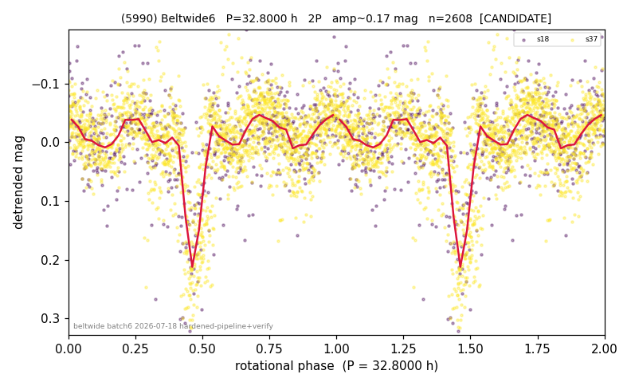

# (5990)

**Adopted:** 8.298 h, 1P, CANDIDATE

<!-- AUTO:START (regenerated from pipeline outputs; do not hand-edit this block) -->
## Evidence (auto)

Detected in 2 sector(s):

| sector | N | baseline (h) | P_phot (h) | power | FAP | cycles | flags |
|--|--|--|--|--|--|--|--|
| s18 | 582 | 469.5 | 8.2992 | 0.1254 | 1.4e-13 | 56.6 | 2P-ambiguous |
| s37 | 2038 | 435.2 | 16.4011 | 0.1109 | 6.8e-48 | 13.3 | clean |

- Pipeline refine said: **1P** (folded amp_fourier 0.079); flags: amp-from-clean-sectors(ignored s18);harmonic-only-agreement:s18(pw=0.07),s37(pw=0.02);peri
- DIA (de-comb): not triggered (clean, fast, non-comb)
- Gates: FAP<1e-3 and power>=0.10 per detecting sector; single strong sector (candidate ceiling).
- Adopted shape: **1P** (folded-amplitude rule; pipeline agrees).

### Why this row reads the way it does

- REVISED 8.298h/1P 2026-07-19 (user-flagged dip forensics): healthy-error transients (track-start scattered-light ramp + crossings, err 1.6-1.8x so sick-rule-immune) inflated long-period LS power; RAW best ~33h in BOTH sectors was contamination-propped. Cleaned: s18 fundamental 8.298h (pw 0.141) and s37 16.399h = 2x8.30 within s37 frequency resolution (3.8%), but s37 fundamental is 0.24% from comb tooth n=20 (de-comb survives, drop 3-18%, weak evidence on-tooth per V3). Folded amp 0.06 after cleaning (raw 0.24 was dip-inflated) -> no amplitude doubling. Cross-sector fold coherence r=0.93 @8.30h vs 0.79 @16.4h. Adopt 8.298h/1P (restores original census 8.25h/1P); 16.6h/2P alternative unresolved, needs 3rd epoch or ZTF (Fink cert-blocked). Was 32.8h/2P (verify-era decision made on contaminated LS).

<!-- AUTO:END -->

## Reasoning (hand-written)

**Period revision (2026-07-19).** The earlier adopted 32.8 h / 2P was an artifact of the
contamination described below: with the transient cadences included, the raw Lomb-Scargle
best period was ~33 h in BOTH sectors, and the verification pass anchored on it. With the
contamination excised, the long-period peak loses the lead in both sectors: s18's
fundamental is 8.298 h (power 0.141) and s37's is 16.399 h, which equals 2 x 8.30 within
s37's frequency resolution (3.8%). The folded amplitude after cleaning is 0.06 mag (the
raw 0.24 was dip-inflated), so no amplitude-mandated doubling applies; cross-sector fold
coherence favors 8.30 h (r = 0.93 vs 0.79 at 16.4 h). Adopted: 8.298 h / 1P, restoring
the original census solution (8.25 h / 1P).

**Why CANDIDATE, not CONFIRMED.** The harmonic ambiguity is real and unresolved: s37's
fundamental at 16.4 h would imply a 16.4-16.6 h double-humped rotation with unequal
halves, and it sits 0.24% from the momentum-dump comb tooth 328.8/20 = 16.44 h. The
de-comb test survives at both candidate periods (power drops 3-18%, far from the kill
line), but survival is weak evidence this close to a tooth. A third epoch or an
independent ground-based data source (ZTF) is needed to settle 8.30 h / 1P vs
16.6 h / 2P.

**The "strange dip" (reviewed 2026-07-19).** The fold showed isolated faint excursions
of 0.5 to 0.8 mag. Forensics: in s37 they form three brief events (durations 0.3 to
1.2 h) ALL within the first 40 h of a ~435 h track, the deepest at the very first
cadences; in s18 a single 0.5 h pair near the end of the track. At P = 32.8 h the s37
track covers ~13 cycles, and none of these features recurs at the same phase in any
other cycle, which rules out a rotational minimum or an eclipse (either would repeat
every cycle). The neighbouring track (3858) in s37 shows the identical first-hour
faint ramp, identifying the class as track-start scattered-light systematics plus
field-star crossings. Their photometric errors are normal (1.6 to 1.8x the sector
median), so the error-gated sick-dip rule correctly leaves them; they are excised from
the displayed fold by the non-recurrent-transient display rule (depth over
max(0.5 mag, 1.5x amplitude), duration under 3 h, phase covered by 3+ other cycles
with no recurrence in the cycle-binned level). The excised cadences are 12 of 2620
total and have no effect on the period solution.
