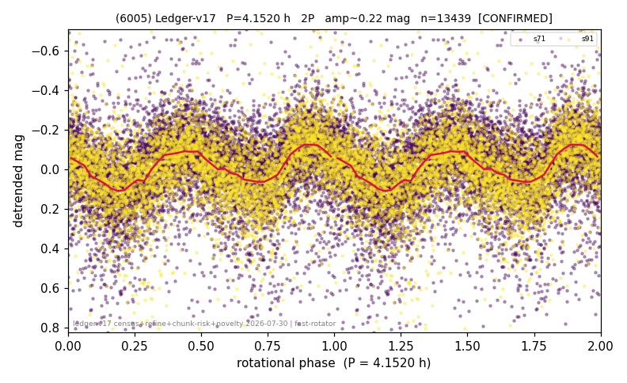

# (6005)

**Adopted:** 4.152 h, 2P, CONFIRMED

<!-- AUTO:START (regenerated from pipeline outputs; do not hand-edit this block) -->
## Evidence (auto)

Detected in 3 sector(s):

| sector | N | baseline (h) | P_phot (h) | power | FAP | cycles | flags |
|--|--|--|--|--|--|--|--|
| s39 | 1839 | 413.3 | 2.0762 | 0.1123 | 1.6e-43 | 99.5 | star-cleaned:1 |
| s71 | 8338 | 592.8 | 2.0751 | 0.1156 | 2.3e-217 | 285.7 | star-cleaned:97,2P-ambiguous |
| s91 | 5187 | 370.7 | 2.0761 | 0.2025 | 4.9e-250 | 178.6 | star-cleaned:37,2P-ambiguous |

- Pipeline refine said: **1P** (folded amp_fourier 0.245); flags: sick-dips-excised:s71(40),s91(24)
- DIA (de-comb): survived(dPW=+3%,R2=0.25,s91@2.076h,4sec)
- Coverage: **2 sector(s)**, best sector covers **142.77 cycles** of the adopted period. Measured periodogram peak width 0% of the period, i.e. about **+/- 0.00324 h** (1 sigma); the decimal places in the adopted value are not a precision claim.
- Factor of two: **measured on the data** (odd-harmonic power or unequal minima, significant and reproduced), METHODOLOGY 3b.
- Gates: FAP<1e-3 and power>=0.10 per detecting sector; >=2 sectors agree (harmonic-aware).
- **Adopted shape 2P OVERRIDES the pipeline's 1P** (doubling audit 2026-07-25: folded amplitude >= 0.25 mag, so a single-peaked curve is physically implausible; Harris convention -> 2P. The census 3-test doubling logic was measured at only 30% recall against 289 LCDB U>=2 ground-truth periods).

### Why this row reads the way it does

- 2 sector(s) detecting
- cross-sector fold correlation 0.88
- single-peaked at folded amp 0.245 mag
- CORRECTED 2.076->4.1520 h (2026-08-01 sub-barrier sweep): all 49 catalog periods below 2.2 h sat on 5-16 km bodies, impossible as true rotations; doubling MEASURED in the 2026-08-01 fast-rotator re-audit: odd-harmonic 5.37 sigma (2/2 sectors), minima z=7.91

<!-- AUTO:END -->
