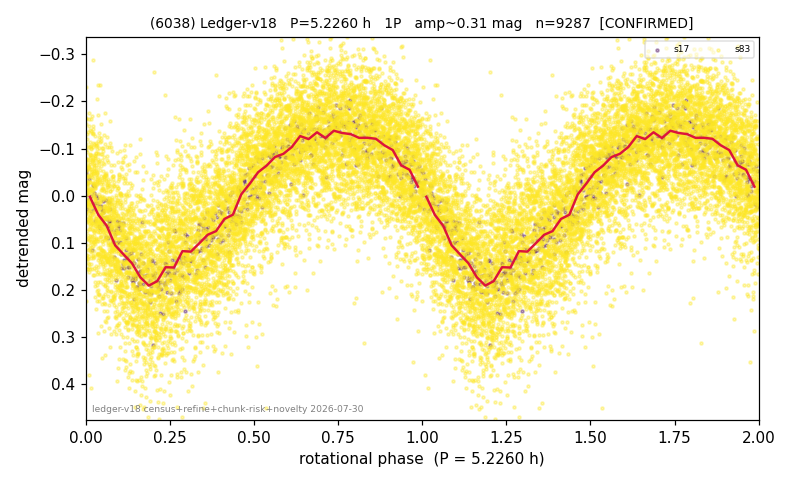

# (6038)

**Adopted:** 5.226 h, 1P, CONFIRMED

<!-- AUTO:START (regenerated from pipeline outputs; do not hand-edit this block) -->
## Evidence (auto)

Detected in 2 sector(s):

| sector | N | baseline (h) | P_phot (h) | power | FAP | cycles | flags |
|--|--|--|--|--|--|--|--|
| s17 | 586 | 530.0 | 5.2264 | 0.8941 | 4.3e-280 | 101.4 | 2P-ambiguous |
| s83 | 8708 | 598.4 | 5.2266 | 0.5271 | 0.0e+00 | 114.5 | 2P-ambiguous |

- Pipeline refine said: **1P** (folded amp_fourier 0.323); flags: sick-dips-excised:s83(5)
- DIA (de-comb): inconclusive(dPW=+18%,R2=0.34,s17@5.226h)
- Coverage: **2 sector(s)**, best sector covers **114.51 cycles** of the adopted period. Measured periodogram peak width 1% of the period, i.e. about **+/- 0.02 h** (1 sigma); the decimal places in the adopted value are not a precision claim.
- Factor of two: no doubling was applied.
- Gates: FAP<1e-3 and power>=0.10 per detecting sector; >=2 sectors agree (harmonic-aware).
- Adopted shape: **1P** (folded-amplitude rule; pipeline agrees).

### Why this row reads the way it does

- 2 sector(s) detecting
- cross-sector fold correlation 0.99
- single-peaked at folded amp 0.323 mag

<!-- AUTO:END -->
