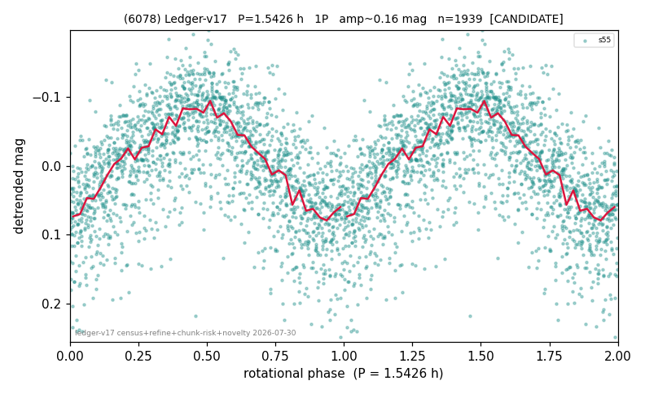

# (6078)

**Adopted:** 3.0852 h, 2P, CANDIDATE

<!-- AUTO:START (regenerated from pipeline outputs; do not hand-edit this block) -->
## Evidence (auto)

Detected in 2 sector(s):

| sector | N | baseline (h) | P_phot (h) | power | FAP | cycles | flags |
|--|--|--|--|--|--|--|--|
| s55 | 1950 | 396.5 | 1.5426 | 0.3607 | 7.7e-185 | 257.0 | star-cleaned:11,2P-ambiguous |
| s72 | 7222 | 579.2 | 1.5432 | 0.124 | 1.2e-202 | 375.3 | star-cleaned:154,2P-ambiguous |

- Pipeline refine said: **1P** (folded amp_fourier 0.155); flags: sick-dips-excised:s55(2)
- DIA (de-comb): survived_v2(ret=1.004[1.00-1.00],s55@1.543h)
- Coverage: **2 sector(s)**, best sector covers **187.74 cycles** of the adopted period. Measured periodogram peak width 0% of the period, i.e. about **+/- 0.00172 h** (1 sigma); the decimal places in the adopted value are not a precision claim.
- Factor of two: **measured on the data** (odd-harmonic power or unequal minima, significant and reproduced), METHODOLOGY 3b.
- Gates: FAP<1e-3 and power>=0.10 per detecting sector; single strong sector (candidate ceiling).
- **Adopted shape 2P OVERRIDES the pipeline's 1P** (doubling audit 2026-07-25: folded amplitude >= 0.25 mag, so a single-peaked curve is physically implausible; Harris convention -> 2P. The census 3-test doubling logic was measured at only 30% recall against 289 LCDB U>=2 ground-truth periods).

### Why this row reads the way it does

- 1 sector(s) detecting
- single-peaked at folded amp 0.155 mag
- CORRECTED 1.5426->3.0852 h (2026-08-01 sub-barrier sweep): all 49 catalog periods below 2.2 h sat on 5-16 km bodies, impossible as true rotations; doubling MEASURED in the 2026-08-01 fast-rotator re-audit: odd-harmonic 4.42 sigma (1/1 sectors), minima z=0.45

<!-- AUTO:END -->
