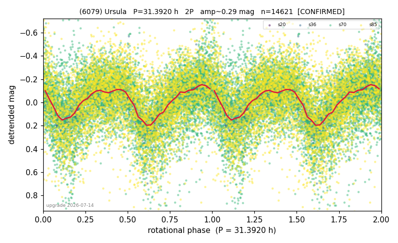

# (6079)

**Adopted:** 31.392 h, 2P, CONFIRMED

<!-- AUTO:START (regenerated from pipeline outputs; do not hand-edit this block) -->
## Evidence (auto)

Detected in 4 sector(s):

| sector | N | baseline (h) | P_phot (h) | power | FAP | cycles | flags |
|--|--|--|--|--|--|--|--|
| s20 | 279 | 167.5 | 15.6352 | 0.6282 | 5.3e-56 | 10.7 | 2P-ambiguous |
| s36 | 1702 | 361.2 | 15.6957 | 0.6114 | 0.0e+00 | 23.0 | star-cleaned:18,2P-ambiguous |
| s70 | 7375 | 596.8 | 15.702 | 0.1343 | 5.2e-226 | 38.0 | star-cleaned:222,2P-ambiguous |
| s85 | 5376 | 465.9 | 15.6972 | 0.1448 | 1.1e-177 | 29.7 | 2P-ambiguous |

- Pipeline refine said: **1P** (folded amp_fourier 0.318); flags: amp-from-clean-sectors(ignored s70,s85);sick-dips-excised:s36(4),s70(20),s85(13)
- DIA (de-comb): survived_v2(ret=0.999[0.99-1.00],s20@15.696h)
- Coverage: **3 sector(s)**, best sector covers **19.01 cycles** of the adopted period. Measured periodogram peak width 2% of the period, i.e. about **+/- 0.154 h** (1 sigma); the decimal places in the adopted value are not a precision claim.
- Factor of two: **adopted on the amplitude convention**: standard practice for an elongated body, but a convention rather than a measurement.
- Gates: FAP<1e-3 and power>=0.10 per detecting sector; >=2 sectors agree (harmonic-aware).
- **Adopted shape 2P OVERRIDES the pipeline's 1P** (doubling audit 2026-07-25: folded amplitude >= 0.25 mag, so a single-peaked curve is physically implausible; Harris convention -> 2P. The census 3-test doubling logic was measured at only 30% recall against 289 LCDB U>=2 ground-truth periods).

### Why this row reads the way it does

- 4 sectors/4.9yr; sidereal beyond tool resolution (fast-rotator limit); P doubled 2026-07-25 (doubling audit: amp>=0.25 + Harris convention)

<!-- AUTO:END -->
