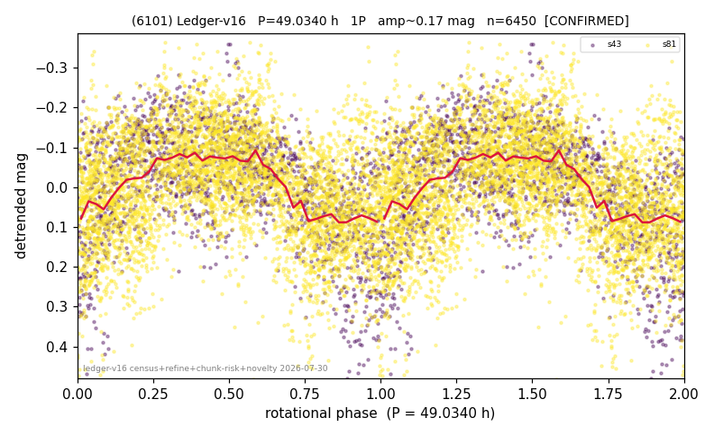

# (6101)

**Adopted:** 49.034 h, 1P, CONFIRMED

<!-- AUTO:START (regenerated from pipeline outputs; do not hand-edit this block) -->
## Evidence (auto)

Detected in 2 sector(s):

| sector | N | baseline (h) | P_phot (h) | power | FAP | cycles | flags |
|--|--|--|--|--|--|--|--|
| s43 | 1703 | 444.7 | 49.1843 | 0.2779 | 6.1e-116 | 4.5 | star-cleaned:4 |
| s81 | 4791 | 578.3 | 48.8845 | 0.1975 | 6.7e-224 | 11.8 | star-cleaned:76,2P-ambiguous |

- Pipeline refine said: **1P** (folded amp_fourier 0.255); flags: sick-dips-excised:s43(1),s81(12)
- DIA (de-comb): survived(dPW=+12%,R2=0.33,s43@49.034h,4sec)
- Gates: FAP<1e-3 and power>=0.10 per detecting sector; >=2 sectors agree (harmonic-aware).
- Adopted shape: **1P** (folded-amplitude rule; pipeline agrees).

### Why this row reads the way it does

- 2 sector(s) detecting
- cross-sector fold correlation 0.73
- single-peaked at folded amp 0.255 mag

<!-- AUTO:END -->
