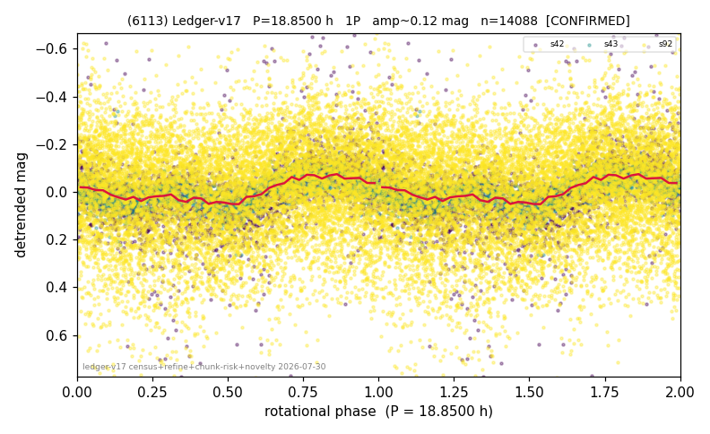

# (6113)

**Adopted:** 18.85 h, 1P, CONFIRMED

<!-- AUTO:START (regenerated from pipeline outputs; do not hand-edit this block) -->
## Evidence (auto)

Detected in 3 sector(s):

| sector | N | baseline (h) | P_phot (h) | power | FAP | cycles | flags |
|--|--|--|--|--|--|--|--|
| s42 | 2622 | 573.4 | 18.8227 | 0.1496 | 7.0e-88 | 30.5 | star-cleaned:4,2P-ambiguous |
| s43 | 1566 | 319.3 | 18.8773 | 0.2247 | 2.3e-82 | 16.9 | star-cleaned:14 |
| s92 | 10089 | 634.1 | 18.8243 | 0.0267 | 1.4e-54 | 33.7 | star-cleaned:79 |

- Pipeline refine said: **1P** (folded amp_fourier 0.241); flags: sick-dips-excised:s42(8),s43(6)
- DIA (de-comb): not triggered (clean, fast, non-comb)
- Gates: FAP<1e-3 and power>=0.10 per detecting sector; >=2 sectors agree (harmonic-aware).
- Adopted shape: **1P** (folded-amplitude rule; pipeline agrees).

### Why this row reads the way it does

- 2 sector(s) detecting
- cross-sector fold correlation 0.91
- single-peaked at folded amp 0.241 mag

<!-- AUTO:END -->
