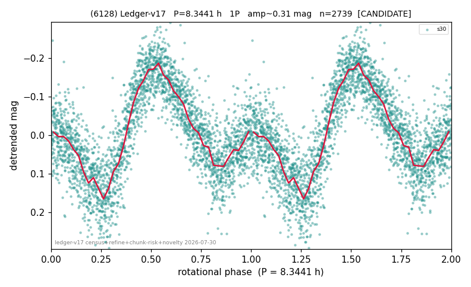

# (6128)

**Adopted:** 8.3441 h, 1P, CANDIDATE

<!-- AUTO:START (regenerated from pipeline outputs; do not hand-edit this block) -->
## Evidence (auto)

Detected in 1 sector(s):

| sector | N | baseline (h) | P_phot (h) | power | FAP | cycles | flags |
|--|--|--|--|--|--|--|--|
| s30 | 2742 | 638.7 | 8.3441 | 0.4053 | 1.9e-304 | 76.5 | star-cleaned:19,2P-ambiguous |

- Pipeline refine said: **1P** (folded amp_fourier 0.204); flags: sick-dips-excised:s30(3)
- DIA (de-comb): survived(dPW=+8%,R2=0.21,s30@8.344h,2sec)
- Coverage: **1 sector(s)**, best sector covers **76.54 cycles** of the adopted period. Measured periodogram peak width 1% of the period, i.e. about **+/- 0.03907 h** (1 sigma); the decimal places in the adopted value are not a precision claim.
- Factor of two: no doubling was applied.
- Gates: FAP<1e-3 and power>=0.10 per detecting sector; single strong sector (candidate ceiling).
- Adopted shape: **1P** (folded-amplitude rule; pipeline agrees).

### Why this row reads the way it does

- 1 sector(s) detecting
- single-peaked at folded amp 0.204 mag

<!-- AUTO:END -->
