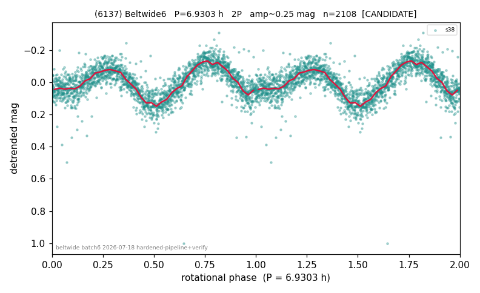

# (6137)

**Adopted:** 6.9303 h, 2P, CANDIDATE

<!-- AUTO:START (regenerated from pipeline outputs; do not hand-edit this block) -->
## Evidence (auto)

Detected in 1 sector(s):

| sector | N | baseline (h) | P_phot (h) | power | FAP | cycles | flags |
|--|--|--|--|--|--|--|--|
| s38 | 2108 | 477.0 | 3.4652 | 0.5643 | 0.0e+00 | 68.8 | clean |

- Pipeline refine said: **1P** (folded amp_fourier 0.246); flags: clean
- DIA (de-comb): not triggered (clean, fast, non-comb)
- Gates: FAP<1e-3 and power>=0.10 per detecting sector; single strong sector (candidate ceiling).
- **Adopted shape 2P OVERRIDES the pipeline's 1P** (doubling audit 2026-07-25: folded amplitude >= 0.25 mag, so a single-peaked curve is physically implausible; Harris convention -> 2P. The census 3-test doubling logic was measured at only 30% recall against 289 LCDB U>=2 ground-truth periods).

### Why this row reads the way it does

- REVIEW-FLAG: folded_amp=0.283. Single sector only (s38, no other lc_6137_s*.csv exist) so cannot exceed CANDIDATE tier; re-running the reference pipeline's own process() on this exact file gives verdict='double-peaked' (fund_fap~0, disp_rati

<!-- AUTO:END -->
