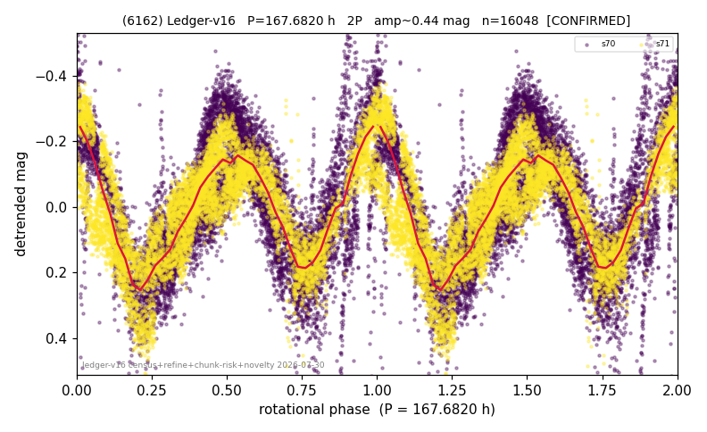

# (6162)

**Adopted:** 167.682 h, 2P, CONFIRMED

<!-- AUTO:START (regenerated from pipeline outputs; do not hand-edit this block) -->
## Evidence (auto)

Detected in 2 sector(s):

| sector | N | baseline (h) | P_phot (h) | power | FAP | cycles | flags |
|--|--|--|--|--|--|--|--|
| s70 | 8747 | 600.9 | 83.7834 | 0.6021 | 0.0e+00 | 7.2 | star-cleaned:82,2P-ambiguous |
| s71 | 7390 | 553.8 | 83.8986 | 0.6555 | 0.0e+00 | 3.3 | star-cleaned:9 |

- Pipeline refine said: **2P** (folded amp_fourier 0.433); flags: near-comb(amp-cleared):n=2,4;few-cycle:3.6;sick-dips-excised:s70(30),s71(55);near-threshol
- DIA (de-comb): not triggered (clean, fast, non-comb)
- Gates: FAP<1e-3 and power>=0.10 per detecting sector; >=2 sectors agree (harmonic-aware).
- Adopted shape: **2P** (folded-amplitude rule; pipeline agrees).

### Why this row reads the way it does

- 2 sector(s) detecting
- cross-sector fold correlation 0.92
- doubling BY CONVENTION: amplitude rule on folded amp 0.433 mag, not individually audited
- pipeline flag: few-cycle

<!-- AUTO:END -->
