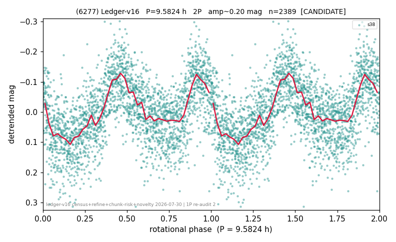

# (6277)

**Adopted:** 4.7912 h, 1P, CANDIDATE

<!-- AUTO:START (regenerated from pipeline outputs; do not hand-edit this block) -->
## Evidence (auto)

Detected in 1 sector(s):

| sector | N | baseline (h) | P_phot (h) | power | FAP | cycles | flags |
|--|--|--|--|--|--|--|--|
| s38 | 2390 | 493.0 | 4.7912 | 0.3471 | 1.5e-216 | 51.4 | star-cleaned:11 |

- Pipeline refine said: **1P** (folded amp_fourier 0.225); flags: sick-dips-excised:s38(1)
- DIA (de-comb): not triggered (clean, fast, non-comb)
- Gates: FAP<1e-3 and power>=0.10 per detecting sector; single strong sector (candidate ceiling).
- Adopted shape: **1P** (folded-amplitude rule; pipeline agrees).

### Why this row reads the way it does

- 1 sector(s) detecting
- single-peaked at folded amp 0.225 mag

<!-- AUTO:END -->
