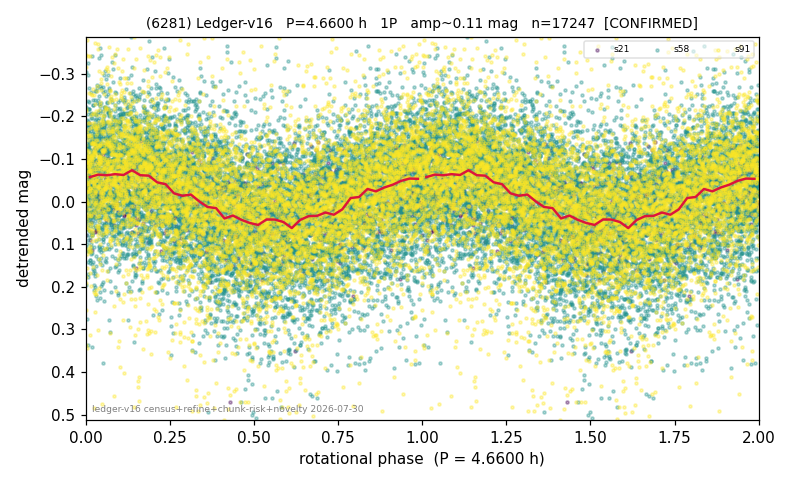

# (6281)

**Adopted:** 4.66 h, 1P, CONFIRMED

<!-- AUTO:START (regenerated from pipeline outputs; do not hand-edit this block) -->
## Evidence (auto)

Detected in 3 sector(s):

| sector | N | baseline (h) | P_phot (h) | power | FAP | cycles | flags |
|--|--|--|--|--|--|--|--|
| s21 | 921 | 642.5 | 4.6603 | 0.1174 | 2.6e-21 | 137.9 | 2P-ambiguous |
| s58 | 9459 | 649.4 | 4.6595 | 0.1183 | 1.6e-253 | 139.4 | star-cleaned:6,2P-ambiguous |
| s91 | 6900 | 647.5 | 4.6608 | 0.1567 | 2.9e-250 | 138.9 | star-cleaned:120,2P-ambiguous |

- Pipeline refine said: **1P** (folded amp_fourier 0.145); flags: sick-dips-excised:s21(1),s58(1),s91(22);harmonic-only-agreement:s21(pw=0.07)
- DIA (de-comb): survived(dPW=+1%,R2=0.01,s58@4.660h,2sec)
- Coverage: **3 sector(s)**, best sector covers **139.36 cycles** of the adopted period. Measured periodogram peak width 1% of the period, i.e. about **+/- 0.01 h** (1 sigma); the decimal places in the adopted value are not a precision claim.
- Factor of two: no doubling was applied.
- Gates: FAP<1e-3 and power>=0.10 per detecting sector; >=2 sectors agree (harmonic-aware).
- Adopted shape: **1P** (folded-amplitude rule; pipeline agrees).

### Why this row reads the way it does

- 3 sector(s) detecting
- cross-sector fold correlation 0.84
- single-peaked at folded amp 0.145 mag
- pipeline flag: harmonic-only-agreement

<!-- AUTO:END -->
