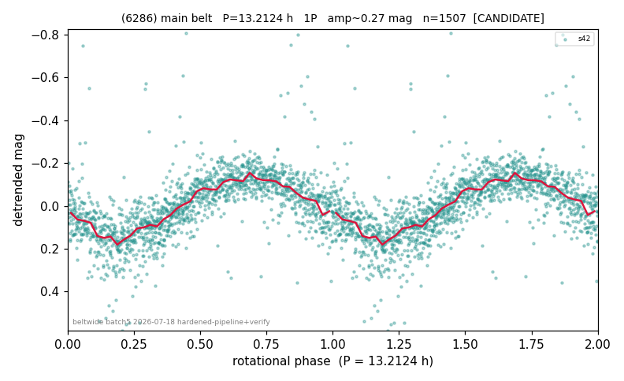

# (6286)

**Adopted:** 13.2124 h, 1P, CANDIDATE

<!-- AUTO:START (regenerated from pipeline outputs; do not hand-edit this block) -->
## Evidence (auto)

Detected in 1 sector(s):

| sector | N | baseline (h) | P_phot (h) | power | FAP | cycles | flags |
|--|--|--|--|--|--|--|--|
| s42 | 1517 | 566.7 | 13.2124 | 0.4378 | 5.6e-185 | 42.9 | star-cleaned:20,2P-ambiguous |

- Refined shape: **1P** (folded amp_fourier 0.281); flags: sick-dips-excised:s42(1)
- DIA (de-comb): survived(dPW=-4%,R2=0.53,s42@13.212h,1sec)
- Gates: FAP<1e-3 and power>=0.10 per detecting sector; single strong sector (candidate ceiling); folded-amplitude rule -> 1P.

<!-- AUTO:END -->
