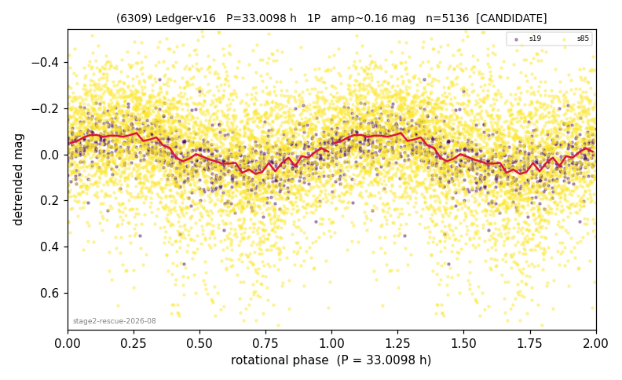

# (6309)

**Adopted:** 66.0196 h, 2P, CANDIDATE

<!-- AUTO:START (regenerated from pipeline outputs; do not hand-edit this block) -->
## Evidence (auto)

Detected in 2 sector(s):

| sector | N | baseline (h) | P_phot (h) | power | FAP | cycles | flags |
|--|--|--|--|--|--|--|--|
| s19 | 923 | 601.0 | 33.007 | 0.3366 | 3.4e-78 | 18.2 | 2P-ambiguous |
| s85 | 4220 | 286.5 | 33.1195 | 0.0754 | 2.2e-67 | 8.6 | clean |

- Coverage: **2 sector(s)**, best sector covers **18.21 cycles** of the adopted period. Measured periodogram peak width 5% of the period, i.e. about **+/- 0.6477 h** (1 sigma); the decimal places in the adopted value are not a precision claim.
- Factor of two: no doubling was applied.
- Gates: FAP<1e-3 and power>=0.10 per detecting sector; single strong sector (candidate ceiling).
- Adopted shape: **2P** (folded-amplitude rule; pipeline agrees).

### Why this row reads the way it does

- stage-2 crowding-rescue harvest (|b| 5-15 deg, METHODOLOGY 5b-ter), verified 2026-08-10 by refutation-first waves: blind LS+PDM re-derivation, harmonic-aware comb test, field control where near-comb (LS power at the same frequency on >=15 unknown objects of the same sector), shape rules per 3b, all vetoes checked
- 1 sector(s) detecting; single strong sector (candidate ceiling)
- DOUBLING CORRECTED 2026-08-30: adopted period doubled from 33.0098 h. The previous value came from the folded-amplitude rule, which was found biased low (9 of 9 disagreements with MPB 2024-2026 in the same direction). Odd-harmonic test at the long period gives z1=6.62 with margin 4.49 over non-harmonic multiples 1.7x/2.3x (reference group: 0 of 38 above margin 2).

<!-- AUTO:END -->
