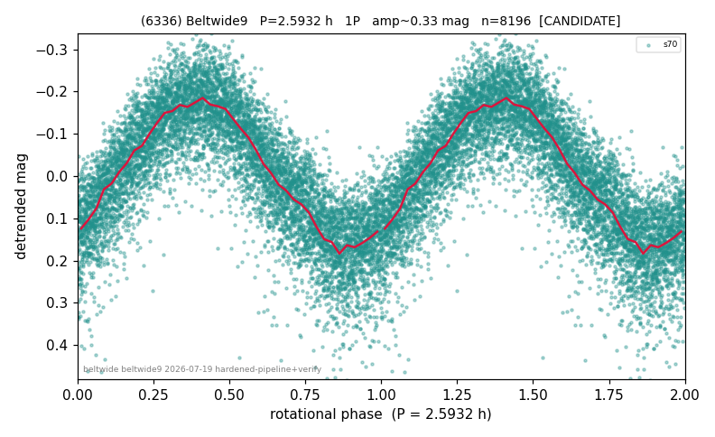

# (6336)

**Adopted:** 2.5932 h, 1P, CANDIDATE

<!-- AUTO:START (regenerated from pipeline outputs; do not hand-edit this block) -->
## Evidence (auto)

Detected in 1 sector(s):

| sector | N | baseline (h) | P_phot (h) | power | FAP | cycles | flags |
|--|--|--|--|--|--|--|--|
| s70 | 8196 | 599.3 | 2.5932 | 0.7112 | 0.0e+00 | 231.1 | 2P-ambiguous |

- Pipeline refine said: **1P** (folded amp_fourier 0.358); flags: near-threshold:0.36
- DIA (de-comb): not triggered (clean, fast, non-comb)
- Gates: FAP<1e-3 and power>=0.10 per detecting sector; single strong sector (candidate ceiling).
- Adopted shape: **1P** (folded-amplitude rule; pipeline agrees).

### Why this row reads the way it does

- folded_amp=0.36. Single-sector s70 (cap) but power 0.71 FAP~0, split-half stable; amp<0.40, identical 2P minima -> 1P; D=8.7km, above barrier. Near-threshold: re-run minima test on promotion.

<!-- AUTO:END -->
