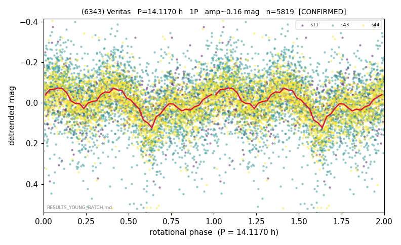

# (6343)

**Adopted:** 14.117 h, 1P, CONFIRMED

<!-- AUTO:START (regenerated from pipeline outputs; do not hand-edit this block) -->
## Evidence (auto)

Detected in 3 sector(s):

| sector | N | baseline (h) | P_phot (h) | power | FAP | cycles | flags |
|--|--|--|--|--|--|--|--|
| s11 | 696 | 590.5 | 4.7044 | 0.0552 | 2.4e-05 | 125.5 | star-cleaned:13 |
| s43 | 2597 | 582.4 | 14.1233 | 0.0574 | 2.9e-29 | 41.2 | star-cleaned:13 |
| s44 | 2543 | 530.5 | 14.112 | 0.1084 | 4.4e-59 | 37.6 | star-cleaned:17,2P-ambiguous |

- Pipeline refine said: **1P** (folded amp_fourier 0.099); flags: sick-dips-excised:s44(10)
- DIA (de-comb): inconclusive(dPW=+36%,R2=0.37,s43@14.112h)
- Coverage: **3 sector(s)**, best sector covers **41.83 cycles** of the adopted period. Measured periodogram peak width 2% of the period, i.e. about **+/- 0.09 h** (1 sigma); the decimal places in the adopted value are not a precision claim.
- Factor of two: no doubling was applied.
- Gates: FAP<1e-3 and power>=0.10 per detecting sector; >=2 sectors agree (harmonic-aware).
- Adopted shape: **1P** (folded-amplitude rule; pipeline agrees).

### Why this row reads the way it does

- CONFIRMED holds: re-verify found S43+S44 both detect (perm ~50sigma/~98sigma, both 14.117h to 0.08%); audit flag was false-positive (fixed power floor N-blind).

<!-- AUTO:END -->
