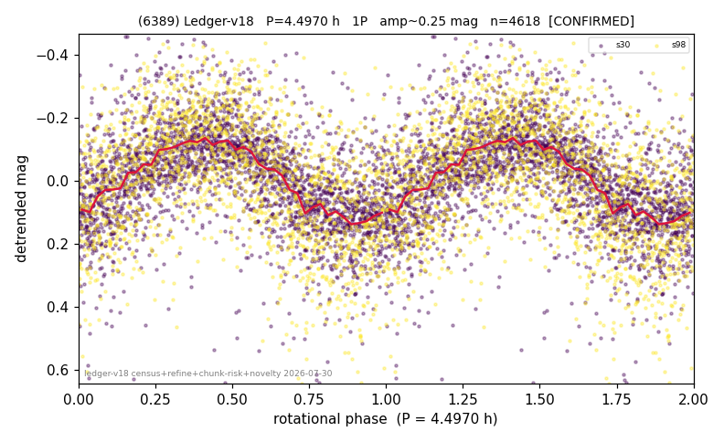

# (6389)

**Adopted:** 4.497 h, 1P, CONFIRMED

<!-- AUTO:START (regenerated from pipeline outputs; do not hand-edit this block) -->
## Evidence (auto)

Detected in 2 sector(s):

| sector | N | baseline (h) | P_phot (h) | power | FAP | cycles | flags |
|--|--|--|--|--|--|--|--|
| s30 | 2776 | 636.2 | 4.4997 | 0.3352 | 2.7e-241 | 141.4 | star-cleaned:12,2P-ambiguous |
| s98 | 1849 | 116.9 | 4.4949 | 0.2649 | 3.7e-119 | 26.0 | 2P-ambiguous |

- Pipeline refine said: **1P** (folded amp_fourier 0.316); flags: sick-dips-excised:s30(2),s98(1)
- DIA (de-comb): survived_v2(ret=1.000[1.00-1.00],s30@4.497h)
- Coverage: **2 sector(s)**, best sector covers **141.47 cycles** of the adopted period. Measured periodogram peak width 1% of the period, i.e. about **+/- 0.01203 h** (1 sigma); the decimal places in the adopted value are not a precision claim.
- Factor of two: no doubling was applied.
- Gates: FAP<1e-3 and power>=0.10 per detecting sector; >=2 sectors agree (harmonic-aware).
- Adopted shape: **1P** (folded-amplitude rule; pipeline agrees).

### Why this row reads the way it does

- 2 sector(s) detecting
- cross-sector fold correlation 0.96
- single-peaked at folded amp 0.316 mag

<!-- AUTO:END -->
