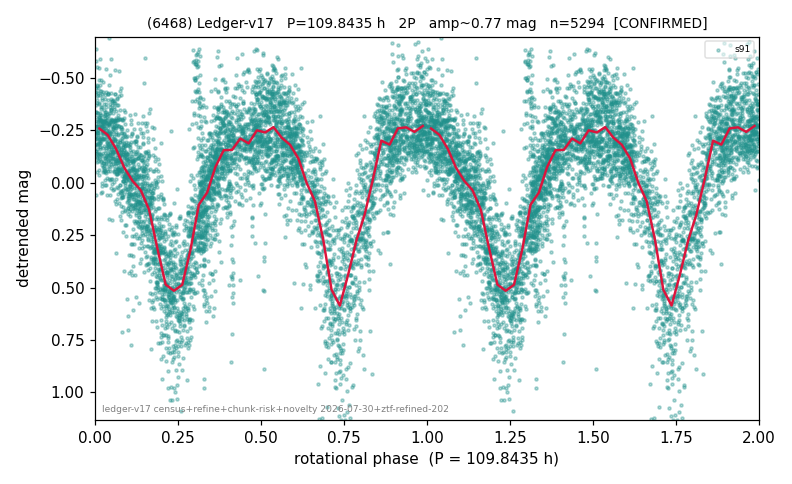

# (6468)

**Adopted:** 109.8435 h, 2P, CONFIRMED

<!-- AUTO:START (regenerated from pipeline outputs; do not hand-edit this block) -->
## Evidence (auto)

Detected in 1 sector(s):

| sector | N | baseline (h) | P_phot (h) | power | FAP | cycles | flags |
|--|--|--|--|--|--|--|--|
| s91 | 5355 | 603.2 | 54.9817 | 0.5144 | 0.0e+00 | 11.0 | 2P-ambiguous |

- Pipeline refine said: **2P** (folded amp_fourier 0.745); flags: near-comb(amp-cleared):n=3,6;gap-alias-risk:103h;sick-dips-excised:s91(70)
- DIA (de-comb): survived(dPW=+4%,R2=0.01,s91@55.244h,2sec)
- Coverage: **1 sector(s)**, best sector covers **5.46 cycles** of the adopted period. Measured periodogram peak width 7% of the period, i.e. about **+/- 1.651 h** (1 sigma); the decimal places in the adopted value are not a precision claim.
- Factor of two: **adopted on the amplitude convention**: standard practice for an elongated body, but a convention rather than a measurement.
- Gates: FAP<1e-3 and power>=0.10 per detecting sector; >=2 sectors agree (harmonic-aware).
- Adopted shape: **2P** (folded-amplitude rule; pipeline agrees).

### Why this row reads the way it does

- 1 sector(s) detecting
- doubling BY CONVENTION: symmetric fold at 0.93 mag amplitude
- CHUNK QUARANTINE (SUPPRESSED): the adopted period is at least half the extraction chunk span, and median-matching the chunks removes variation slower than one chunk. Needs a direct re-extraction before this period can be claimed
- CHUNK QUARANTINE LIFTED by direct re-extraction 2026-08-05: the sector(s) were re-extracted without chunking and the power at the adopted period is retained or improved (s91 power 0.440->0.523). The stitching filter was not creating this period.
- PERIOD REFINED + PROMOTED 2026-08-15 (TESS+ZTF joint): ZTF blind peak 54.9218h over 6.7 yr / 391 points (power 0.745, FAP at the TESS family period 1.7e-91) sits -0.58% from the TESS value; TESS is agnostic within its peak width (summed power 0.523 old vs 0.529 refined), so the multi-year baseline wins (precedent 18070) -> P = 109.8435h; single-sector ceiling lifted by the independent realization

<!-- AUTO:END -->
