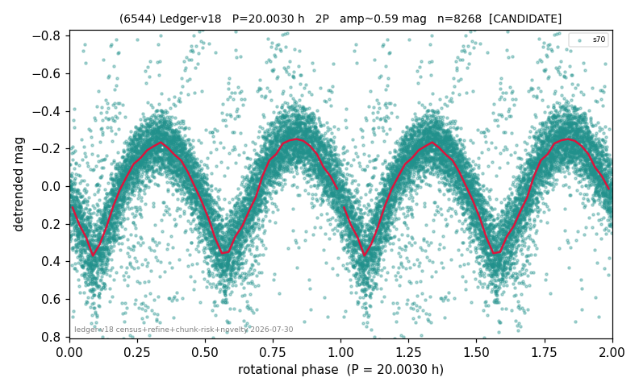

# (6544)

**Adopted:** 20.003 h, 2P, CONFIRMED

<!-- AUTO:START (regenerated from pipeline outputs; do not hand-edit this block) -->
## Evidence (auto)

Detected in 1 sector(s):

| sector | N | baseline (h) | P_phot (h) | power | FAP | cycles | flags |
|--|--|--|--|--|--|--|--|
| s70 | 8368 | 580.7 | 10.0015 | 0.6385 | 0.0e+00 | 58.1 | star-cleaned:82,2P-ambiguous |

- Pipeline refine said: **2P** (folded amp_fourier 0.56); flags: sick-dips-excised:s70(92)
- DIA (de-comb): survived_v2(ret=1.001[1.00-1.00],s70@10.002h)
- Coverage: **1 sector(s)**, best sector covers **29.03 cycles** of the adopted period. Measured periodogram peak width 1% of the period, i.e. about **+/- 0.06022 h** (1 sigma); the decimal places in the adopted value are not a precision claim.
- Factor of two: **adopted on the amplitude convention**: standard practice for an elongated body, but a convention rather than a measurement.
- Gates: FAP<1e-3 and power>=0.10 per detecting sector; >=2 sectors agree (harmonic-aware).
- Adopted shape: **2P** (folded-amplitude rule; pipeline agrees).

### Why this row reads the way it does

- 1 sector(s) detecting
- doubling BY CONVENTION: amplitude rule on folded amp 0.560 mag, not individually audited
- PROMOTED CANDIDATE->CONFIRMED 2026-08-15 (TESS+ZTF joint, the user-blessed pathway): independent ZTF blind Lomb-Scargle over 6.7 yr / 366 g+r points recovers 9.9947 h = TESS-P/2 10.0015h to 0.07%, power 0.742, trials-corrected FAP 2.1e-101, beating every alias/comb candidate (comb n=33 9.964h at 0.732); a ZTF detection cannot be a TESS comb tooth or TESS red noise, so this is a genuine second realization and the single-sector ceiling no longer applies

<!-- AUTO:END -->
