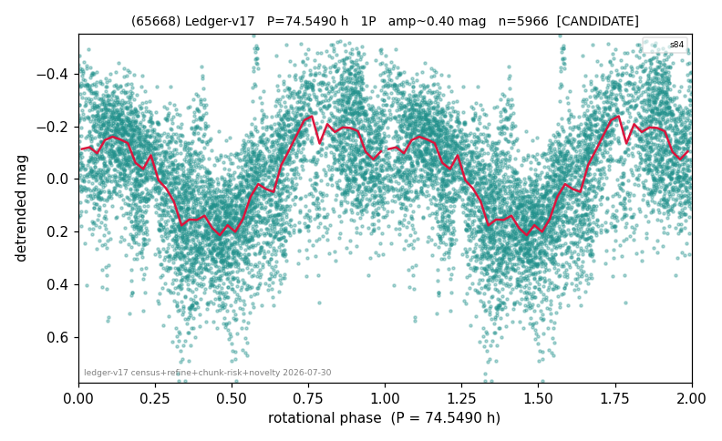

# (65668)

**Adopted:** 74.549 h, 1P, CANDIDATE

<!-- AUTO:START (regenerated from pipeline outputs; do not hand-edit this block) -->
## Evidence (auto)

Detected in 1 sector(s):

| sector | N | baseline (h) | P_phot (h) | power | FAP | cycles | flags |
|--|--|--|--|--|--|--|--|
| s84 | 6150 | 475.3 | 74.549 | 0.3034 | 0.0e+00 | 6.4 | star-cleaned:63,2P-ambiguous |

- Pipeline refine said: **1P** (folded amp_fourier 0.383); flags: few-cycle:3.2;sick-dips-excised:s84(43);near-threshold:0.38
- DIA (de-comb): not triggered (clean, fast, non-comb)
- Gates: FAP<1e-3 and power>=0.10 per detecting sector; single strong sector (candidate ceiling).
- Adopted shape: **1P** (folded-amplitude rule; pipeline agrees).

### Why this row reads the way it does

- 1 sector(s) detecting
- single-peaked at folded amp 0.383 mag
- CHUNK QUARANTINE (SUPPRESSED): the adopted period is at least half the extraction chunk span, and median-matching the chunks removes variation slower than one chunk. Needs a direct re-extraction before this period can be claimed
- pipeline flag: few-cycle

<!-- AUTO:END -->
