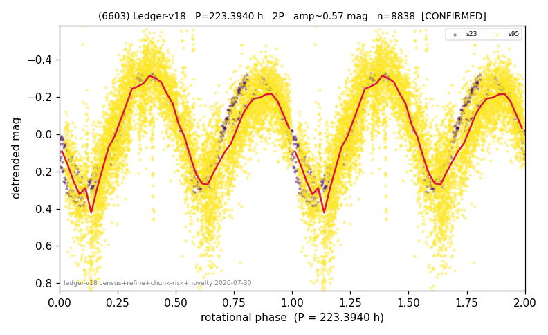

# (6603)

**Adopted:** 223.394 h, 2P, CONFIRMED

<!-- AUTO:START (regenerated from pipeline outputs; do not hand-edit this block) -->
## Evidence (auto)

Detected in 2 sector(s):

| sector | N | baseline (h) | P_phot (h) | power | FAP | cycles | flags |
|--|--|--|--|--|--|--|--|
| s23 | 688 | 585.5 | 111.5653 | 0.8773 | 9.4e-308 | 5.2 | 2P-ambiguous |
| s95 | 8202 | 600.3 | 111.8293 | 0.6047 | 0.0e+00 | 2.7 | star-cleaned:22 |

- Pipeline refine said: **2P** (folded amp_fourier 0.632); flags: amp-from-clean-sectors(ignored s95);near-comb(amp-cleared):n=3;few-cycle:2.7;gap-alias-ris
- DIA (de-comb): survived(dPW=+4%,R2=0.04,s23@111.697h,5sec)
- Coverage: **2 sector(s)**, best sector covers **2.68 cycles** of the adopted period. Measured periodogram peak width 14% of the period, i.e. about **+/- 6.725 h** (1 sigma); the decimal places in the adopted value are not a precision claim.
- Factor of two: **adopted on the amplitude convention**: standard practice for an elongated body, but a convention rather than a measurement.
- Gates: FAP<1e-3 and power>=0.10 per detecting sector; >=2 sectors agree (harmonic-aware).
- Adopted shape: **2P** (folded-amplitude rule; pipeline agrees).

### Why this row reads the way it does

- 2 sector(s) detecting
- cross-sector fold correlation 0.95
- doubling BY CONVENTION: amplitude rule on folded amp 0.632 mag, not individually audited
- chunked sectors flagged (SUPPRESSED;direct-sector-supported) but a directly extracted sector carries the period
- pipeline flag: few-cycle
- chunk-extracted sectors re-extracted DIRECTLY 2026-08-06: power at the adopted period retained (s23 0.879->0.879, s95 0.560->0.507); the direct curves are now the published ones, so this period no longer rests on chunked photometry

<!-- AUTO:END -->
