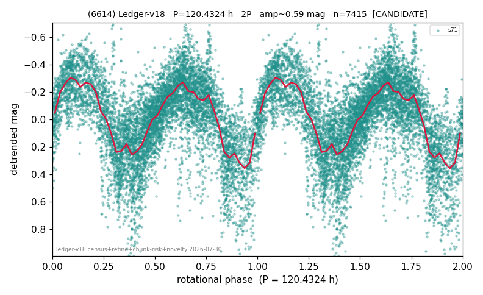

# (6614)

**Adopted:** 120.4324 h, 2P, CANDIDATE

<!-- AUTO:START (regenerated from pipeline outputs; do not hand-edit this block) -->
## Evidence (auto)

Detected in 1 sector(s):

| sector | N | baseline (h) | P_phot (h) | power | FAP | cycles | flags |
|--|--|--|--|--|--|--|--|
| s71 | 7515 | 596.8 | 60.2162 | 0.4735 | 0.0e+00 | 5.0 | star-cleaned:49 |

- Pipeline refine said: **2P** (folded amp_fourier 0.569); flags: sick-dips-excised:s71(52)
- DIA (de-comb): survived(dPW=+3%,R2=0.02,s71@60.216h,2sec)
- Coverage: **1 sector(s)**, best sector covers **4.97 cycles** of the adopted period. Measured periodogram peak width 9% of the period, i.e. about **+/- 2.4 h** (1 sigma); the decimal places in the adopted value are not a precision claim.
- Factor of two: **adopted on the amplitude convention**: standard practice for an elongated body, but a convention rather than a measurement.
- Gates: FAP<1e-3 and power>=0.10 per detecting sector; single strong sector (candidate ceiling).
- Adopted shape: **2P** (folded-amplitude rule; pipeline agrees).

### Why this row reads the way it does

- 1 sector(s) detecting
- doubling BY CONVENTION: amplitude rule on folded amp 0.569 mag, not individually audited
- CHUNK QUARANTINE (SUPPRESSED;BROKEN_CHUNK): the adopted period is at least half the extraction chunk span, and median-matching the chunks removes variation slower than one chunk; a chunk returned too few points for its median to mean anything, or the applied offsets are large and not a smooth ramp. Needs a direct re-extraction before this period can be claimed
- CHUNK QUARANTINE LIFTED by direct re-extraction 2026-08-05: the sector(s) were re-extracted without chunking and the power at the adopted period is retained or improved (s71 power 0.387->0.431). The stitching filter was not creating this period.

<!-- AUTO:END -->
