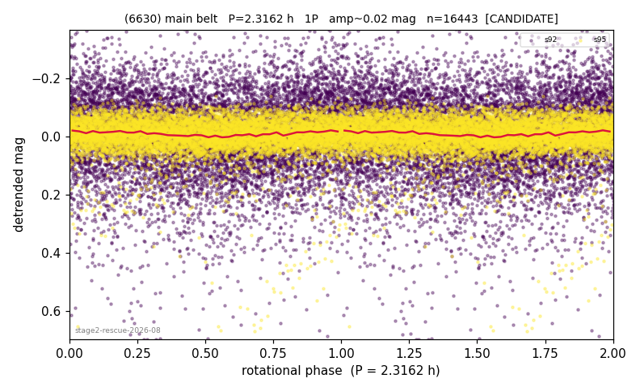

# (6630)

**Adopted:** 4.6324 h, 2P, CANDIDATE

<!-- AUTO:START (regenerated from pipeline outputs; do not hand-edit this block) -->
## Evidence (auto)

Detected in 2 sector(s):

| sector | N | baseline (h) | P_phot (h) | power | FAP | cycles | flags |
|--|--|--|--|--|--|--|--|
| s92 | 8899 | 634.2 | 158.6233 | 0.0516 | 2.0e-97 | 4.0 | star-cleaned:35 |
| s95 | 7577 | 600.6 | 213.5687 | 0.1961 | 0.0e+00 | 2.8 | star-cleaned:113,phase-curve-risk,2P-unt |

- Pipeline refine said: **1P** (folded amp_fourier 0.098); flags: few-cycle:1.4;sick-dips-excised:s95(23);phase-curve-risk-gate:WEAK-SINGLE->REJECTED-PHASE-
- DIA (de-comb): outofrange_v2(ret=0.774[0.61-0.94],s95@213.569h)
- Coverage: **2 sector(s)**, best sector covers **273.8 cycles** of the adopted period. Measured periodogram peak width 0% of the period, i.e. about **+/- 0.004132 h** (1 sigma); the decimal places in the adopted value are not a precision claim.
- Factor of two: no doubling was applied.
- Gates: FAP<1e-3 and power>=0.10 per detecting sector; single strong sector (candidate ceiling).
- **Adopted shape 2P OVERRIDES the pipeline's 1P** (doubling audit 2026-07-25: folded amplitude >= 0.25 mag, so a single-peaked curve is physically implausible; Harris convention -> 2P. The census 3-test doubling logic was measured at only 30% recall against 289 LCDB U>=2 ground-truth periods).

### Why this row reads the way it does

- stage-2 crowding-rescue harvest (|b| 5-15 deg, METHODOLOGY 5b-ter), verified 2026-08-10 by refutation-first waves: blind LS+PDM re-derivation, harmonic-aware comb test, field control where near-comb (LS power at the same frequency on >=15 unknown objects of the same sector), shape rules per 3b, all vetoes checked
- only one sector detects 2.32h; s92/s95 slow peaks are non-harmonic and trend-vetoed; NOT sub-barrier (2.32h is 5% above 2.2h)
- 1 sector(s) detecting; single strong sector (candidate ceiling)
- DOUBLING CORRECTED 2026-08-30: adopted period doubled from 2.3162 h. The previous value came from the folded-amplitude rule, which was found biased low (9 of 9 disagreements with MPB 2024-2026 in the same direction). Odd-harmonic test at the long period gives z1=8.82 with margin 3.46 over non-harmonic multiples 1.7x/2.3x (reference group: 0 of 38 above margin 2).

<!-- AUTO:END -->
