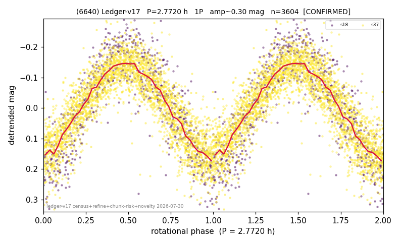

# (6640)

**Adopted:** 2.772 h, 1P, CONFIRMED

<!-- AUTO:START (regenerated from pipeline outputs; do not hand-edit this block) -->
## Evidence (auto)

Detected in 2 sector(s):

| sector | N | baseline (h) | P_phot (h) | power | FAP | cycles | flags |
|--|--|--|--|--|--|--|--|
| s18 | 741 | 565.0 | 2.7715 | 0.7557 | 9.8e-222 | 203.9 | 2P-ambiguous |
| s37 | 2873 | 602.5 | 2.7715 | 0.7637 | 0.0e+00 | 217.4 | 2P-ambiguous |

- Pipeline refine said: **1P** (folded amp_fourier 0.394); flags: near-threshold:0.39
- DIA (de-comb): not triggered (the object is clean, fast and non-comb, so the test does not apply)
- Gates: FAP<1e-3 and power>=0.10 per detecting sector; >=2 sectors agree (harmonic-aware).
- Adopted shape: **1P** (folded-amplitude rule; pipeline agrees).

### Why this row reads the way it does

- 2 sector(s) detecting
- cross-sector fold correlation 0.98
- single-peaked at folded amp 0.394 mag

<!-- AUTO:END -->
