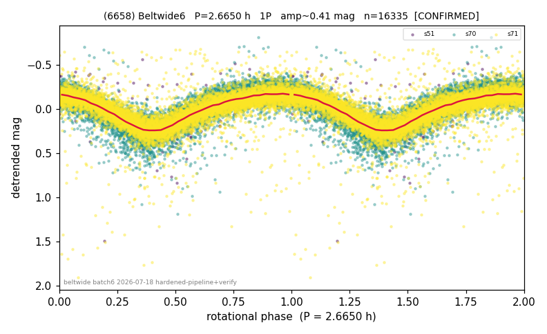

# (6658)

**Adopted:** 2.665 h, 1P, CONFIRMED

<!-- AUTO:START (regenerated from pipeline outputs; do not hand-edit this block) -->
## Evidence (auto)

Detected in 3 sector(s):

| sector | N | baseline (h) | P_phot (h) | power | FAP | cycles | flags |
|--|--|--|--|--|--|--|--|
| s51 | 492 | 270.3 | 2.664 | 0.6054 | 5.5e-95 | 101.5 | star-cleaned:12,2P-ambiguous |
| s70 | 6781 | 526.8 | 2.6654 | 0.6658 | 0.0e+00 | 197.6 | star-cleaned:9,2P-ambiguous |
| s71 | 9062 | 608.1 | 2.6648 | 0.6467 | 0.0e+00 | 228.2 | star-cleaned:95,2P-ambiguous |

- Refined shape: **2P** (folded amp_fourier 0.465); flags: sick-dips-excised:s51(2),s70(2),s71(51)
- DIA (de-comb): survived(dPW=+1%,R2=0.01,s70@2.665h,5sec)
- Gates: FAP<1e-3 and power>=0.10 per detecting sector; >=2 sectors agree (harmonic-aware); folded-amplitude rule -> 1P.

<!-- AUTO:END -->
