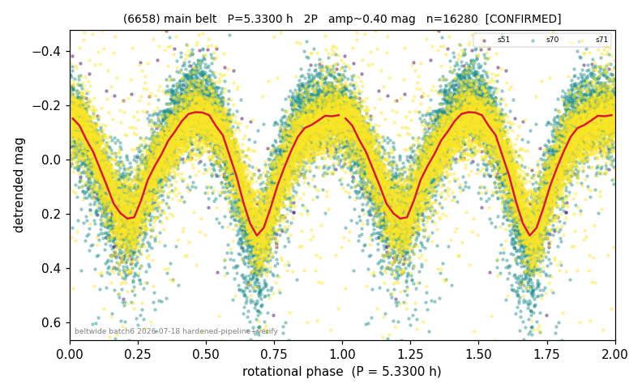

# (6658)

**Adopted:** 5.33 h, 2P, CONFIRMED

<!-- AUTO:START (regenerated from pipeline outputs; do not hand-edit this block) -->
## Evidence (auto)

Detected in 3 sector(s):

| sector | N | baseline (h) | P_phot (h) | power | FAP | cycles | flags |
|--|--|--|--|--|--|--|--|
| s51 | 492 | 270.3 | 2.664 | 0.6054 | 5.5e-95 | 101.5 | star-cleaned:12,2P-ambiguous |
| s70 | 6781 | 526.8 | 2.6654 | 0.6658 | 0.0e+00 | 197.6 | star-cleaned:9,2P-ambiguous |
| s71 | 9062 | 608.1 | 2.6648 | 0.6467 | 0.0e+00 | 228.2 | star-cleaned:95,2P-ambiguous |

- Pipeline refine said: **2P** (folded amp_fourier 0.465); flags: sick-dips-excised:s51(2),s70(2),s71(51)
- DIA (de-comb): survived_v2(ret=0.999[1.00-1.00],s70@2.665h)
- Coverage: **3 sector(s)**, best sector covers **114.09 cycles** of the adopted period. Measured periodogram peak width 0% of the period, i.e. about **+/- 0.004754 h** (1 sigma); the decimal places in the adopted value are not a precision claim.
- Factor of two: **adopted on the amplitude convention**: standard practice for an elongated body, but a convention rather than a measurement.
- Gates: FAP<1e-3 and power>=0.10 per detecting sector; >=2 sectors agree (harmonic-aware).
- Adopted shape: **2P** (folded-amplitude rule; pipeline agrees).

### Why this row reads the way it does

- REVIEW-FLAG: folded_amp=0.28. All 3 sectors (S51/S70/S71) independently find P~2.66-2.67h with FAP~0/1e-93 (100-228 cycles each) -> genuine cross-sector CONFIRMED; but folded/binned-ridge amplitude across all sectors is only 0.27-0.28 mag (; P doubled 2026-07-25 (doubling audit: amp>=0.25 + Harris convention)

<!-- AUTO:END -->
